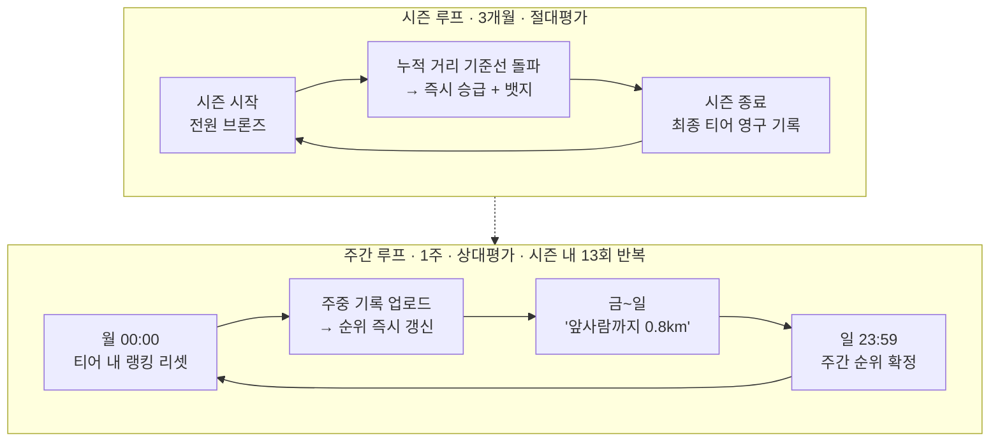

# 🏃 Runnit

> **혼자 달려도 경쟁이 되는 러닝 앱**
> 아는 사람 없이 시작해서, 뛴 만큼 티어가 오르고 순위가 오른다.

<p>
  
  
  
  
</p>

---

## 왜 만드는가

러닝 인구는 늘었지만 대다수는 **혼자 달리다 3개월 안에 그만둔다.** 기존 앱은 두 갈래로 갈린다.

| | 문제 |
|---|---|
| **기록 정밀도형** (Garmin, Apple 피트니스) | 데이터는 정확하지만 **달릴 이유**를 만들어주지 못한다 |
| **소셜 커뮤니티형** (Strava, NRC) | 피드·팔로우·클럽 중심이라 **관계 맺기가 전제**된다 |

즉 **혼자여도 성립하는 경쟁**이라는 축이 비어 있다.
대다수 러너는 크루에 가입할 생각이 없고, 남의 피드를 보고 싶어하지도 않는다.
그저 **자기 노력이 눈에 보이게 쌓이고, 남들 사이에서 자기 위치를 알고 싶을 뿐이다.**

> **Runnit은 가입 즉시 아무도 팔로우하지 않은 채로 경쟁이 시작된다.**

---

## 핵심 설계 — 시간축이 다른 3중 보상

이 제품의 뼈대는 **서로 다른 시간축의 보상을 겹쳐 쌓는 것**이다.

| 보상 | 주기 | 평가 방식 | 심리적 역할 |
|------|------|----------|------------|
| 📊 **주간 랭킹** | 1주 (리셋) | **상대평가** — 같은 티어 내 순위 | 지금 당장 뛸 이유 — **긴박감** |
| 🏆 **티어** | 3개월 (분기 시즌) | **절대평가** — 시즌 누적 거리 | 시즌을 관통하는 목표 — **성취감** |
| 🏅 **뱃지 · 레벨** | 영구 (누적) | 절대평가 | 그만두지 못할 이유 — **매몰 자산** |

세 축은 서로를 대체하지 않는다.
랭킹만 있으면 하위권이 이탈하고, 티어만 있으면 3개월이 너무 길며, 뱃지만 있으면 경쟁이 성립하지 않는다.

### 티어 (절대평가)

남이 얼마나 뛰든 무관하게 **내 시즌 누적 거리가 기준선을 넘으면 승급**한다.

| 티어 | 시즌 누적 거리 | 도달 예상 |
|------|--------------|----------|
| 🥉 브론즈 | 0km ~ | 가입 즉시 |
| 🥈 실버 | 25km ~ | 2~3주차 |
| 🥇 골드 | 100km ~ | 6~7주차 |
| 💎 플래티넘 | 250km ~ | 11~13주차 |

- 시즌 중 **강등 없음** — 부상·휴식을 처벌하지 않는다
- 시즌 종료 시 초기화되지만, **"2026 Q3 플래티넘" 뱃지는 영구히 남는다**
- 절대평가이므로 **사용자가 10명이어도 정상 작동한다**

### 이중 경쟁 루프



---

## 현재 상태

**기획 완료 · 개발 착수 전.** 아직 애플리케이션 코드는 없다.

| 단계 | 상태 |
|------|------|
| 제품 기획 (PRD) | ✅ v1.3 확정 |
| 개발 하네스 구성 | ✅ 에이전트 6 · 스킬 7 |
| Phase 0 (아키텍처·스키마) | ⬜ 예정 |

---

## 문서

| 문서 | 내용 |
|------|------|
| [docs/PRD.md](docs/PRD.md) | **제품 사양의 단일 진실 원천.** 기능 요구사항, 티어·랭킹 정책, 부정행위 방지, KPI |
| [CLAUDE.md](CLAUDE.md) | 개발 하네스 진입점 |

> 📌 **PRD가 모든 구현 판단의 기준이다.** 코드·문서·에이전트 지시가 PRD와 충돌하면 PRD가 우선한다.

---

## 기술 스택

| 영역 | 선택 | 비고 |
|------|------|------|
| 앱 | **Flutter** | iOS 15+ / Android 8.0+ 동시 출시 |
| 상태관리 | **Riverpod** | |
| 백엔드 | **Supabase** | Postgres · Auth · Realtime · Edge Functions |
| 지도 | **Naver Map** | 국내 지도 품질·과금 구조 우위 |
| 푸시 | **FCM** | |
| 웨어러블 | **HealthKit / Health Connect** | Garmin은 이를 경유 (Phase 4) |

### 설계 원칙

- **서버가 단일 진실 원천** — 클라이언트가 계산한 거리·티어·순위를 신뢰하지 않고, 원본 GPS 샘플로 **서버에서 재계산**한다
- **기록 손실 0** — 트래킹 중 크래시가 나도 로컬 저장분으로 복구된다
- **오프라인 우선** — 네트워크 없이 기록하고, 복귀 시 자동 동기화한다
- **경로 유무로 판정** — 웨어러블·수동 기록의 티어 반영 여부는 기기 종류가 아니라 **경로 샘플의 유무**로 가른다

---

## 로드맵

주 20시간 투입 기준. 상세는 [PRD §11](docs/PRD.md).

| Phase | 기간 | 범위 |
|-------|------|------|
| **0** | 3주 | 아키텍처 · 데이터 모델 · Supabase 스키마 |
| **1** | 10주 | GPS 트래킹 · 기록 저장/히스토리 · 계정 |
| **2** | 8주 | 티어 · 주간 랭킹 · 뱃지/레벨 · 서버 검증 · 공유 카드 |
| **3** | 5주 | 베타 · 성능/배터리 최적화 · 스토어 심사 |
| 🚀 **MVP** | **~26주** | P0 전체 |
| **4** | +13주 | 웨어러블 연동 · 포인트 이코노미 |
| **5** | +13주 | 그룹 기능 · B2B 기업 챌린지 |

---

## 개발 방식

이 저장소는 **Claude Code 기반 에이전트 하네스**로 개발된다.
기능 요청이 들어오면 오케스트레이터가 범위를 분석해 필요한 전문가만 동적으로 소집한다.

```
.claude/
├── agents/     mobile-architect · gps-tracking-engineer · gamification-designer
│               backend-engineer · flutter-ui-designer · qa-integration-tester
└── skills/     running-app-builder (오케스트레이터) + 도메인 스킬 6종
```

모든 에이전트와 스킬은 작업 전 `docs/PRD.md`를 읽도록 구성되어 있다.

---

## 하지 않을 것

- 소셜 피드 · 팔로우 · DM — **관계 맺기를 전제하지 않는 것이 차별점이다**
- 크루 중심 설계 — 크루에서 활용될 수는 있으나, 크루를 위한 앱이 아니다
- 코칭 · 훈련 프로그램 생성
- 러닝 외 종목 (사이클 · 수영)
- 포인트의 현금 환급 — 상품 교환만 지원

---

<sub>1인 개발 프로젝트 · 문서 최종 갱신 2026-08-19</sub>
