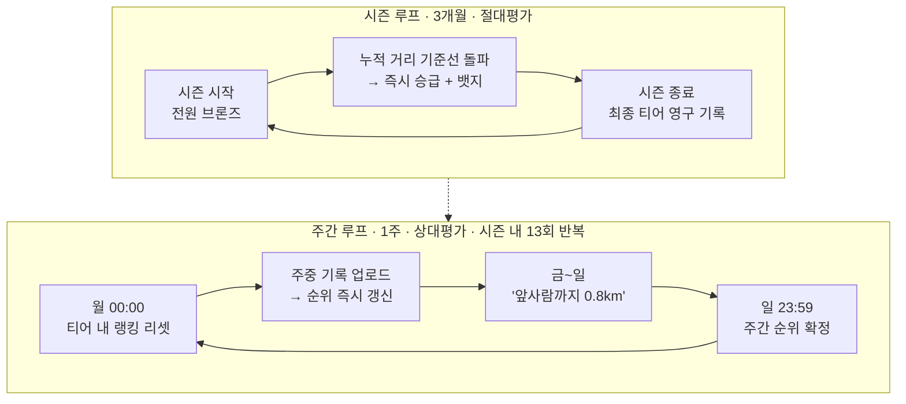

# 🏃 Runnit

> **혼자 달려도 경쟁이 되는 러닝 앱**
> 아는 사람 없이 시작해서, 뛴 만큼 티어가 오르고 순위가 오른다.

<p>
  
  
  
  
  
  
</p>

---

## 왜 만드는가

러닝 인구는 늘었지만 대다수는 **혼자 달리다 3개월 안에 그만둔다.** 기존 앱은 두 갈래로 갈린다.

| | 문제 |
|---|---|
| **기록 정밀도형** (Garmin, Apple 피트니스) | 데이터는 정확하지만 **달릴 이유**를 만들어주지 못한다 |
| **소셜 커뮤니티형** (Strava, NRC) | 피드·팔로우·클럽 중심이라 **관계 맺기가 전제**된다 |

즉 **혼자여도 성립하는 경쟁**이라는 축이 비어 있다.
대다수 러너는 크루에 가입할 생각이 없고, 남의 피드를 보고 싶어하지도 않는다.
그저 **자기 노력이 눈에 보이게 쌓이고, 남들 사이에서 자기 위치를 알고 싶을 뿐이다.**

> **Runnit은 가입 즉시 아무도 팔로우하지 않은 채로 경쟁이 시작된다.**

---

## 핵심 설계 — 시간축이 다른 3중 보상

이 제품의 뼈대는 **서로 다른 시간축의 보상을 겹쳐 쌓는 것**이다.

| 보상 | 주기 | 평가 방식 | 심리적 역할 |
|------|------|----------|------------|
| 📊 **주간 랭킹** | 1주 (리셋) | **상대평가** — 같은 티어 내 순위 | 지금 당장 뛸 이유 — **긴박감** |
| 🏆 **티어** | 3개월 (분기 시즌) | **절대평가** — 시즌 누적 거리 | 시즌을 관통하는 목표 — **성취감** |
| 🏅 **뱃지 · 레벨** | 영구 (누적) | 절대평가 | 그만두지 못할 이유 — **매몰 자산** |

세 축은 서로를 대체하지 않는다.
랭킹만 있으면 하위권이 이탈하고, 티어만 있으면 3개월이 너무 길며, 뱃지만 있으면 경쟁이 성립하지 않는다.

### 티어 (절대평가)

남이 얼마나 뛰든 무관하게 **내 시즌 누적 거리가 기준선을 넘으면 승급**한다.

| 티어 | 시즌 누적 거리 | 도달 예상 |
|------|--------------|----------|
| 🥉 브론즈 | 0km ~ | 가입 즉시 |
| 🥈 실버 | 25km ~ | 2~3주차 |
| 🥇 골드 | 100km ~ | 6~7주차 |
| 💎 플래티넘 | 250km ~ | 11~13주차 |

- 시즌 중 **강등 없음** — 부상·휴식을 처벌하지 않는다
- 시즌 종료 시 초기화되지만, **"2026 Q3 플래티넘" 뱃지는 영구히 남는다**
- 절대평가이므로 **사용자가 10명이어도 정상 작동한다**

### 이중 경쟁 루프


```mermaid
flowchart TD
    subgraph S["시즌 루프 · 3개월 · 절대평가"]
        S1["시즌 시작<br/>전원 브론즈"] --> S2["누적 거리 기준선 돌파<br/>→ 즉시 승급 + 뱃지"]
        S2 --> S3["시즌 종료<br/>최종 티어 영구 기록"]
        S3 --> S1
    end

    subgraph W["주간 루프 · 1주 · 상대평가 · 시즌 내 13회 반복"]
        W1["월 00:00<br/>티어 내 랭킹 리셋"] --> W2["주중 기록 업로드<br/>→ 순위 즉시 갱신"]
        W2 --> W3["금~일<br/>'앞사람까지 0.8km'"]
        W3 --> W4["일 23:59<br/>주간 순위 확정"]
        W4 --> W1
    end

    S -.-> W
```

---

## 현재 상태

**개발 진행 중 — Phase 1 완료, Phase 2 구현 중.** Flutter 앱과 Supabase 백엔드가 동작한다.

| 단계 | 상태 |
|------|------|
| 제품 기획 (PRD) | ✅ v1.10 확정 |
| 개발 하네스 구성 | ✅ 에이전트 6 · 스킬 7 |
| Phase 0 — 아키텍처 · 데이터 모델 · Supabase 스키마 | ✅ 완료 |
| Phase 1 — GPS 트래킹 · 기록 저장/히스토리 · 계정 · 오프라인 동기화 | ✅ 완료 |
| Phase 2 — 티어 · 주간 랭킹 · 뱃지/레벨 · 서버 검증 · 공유 카드 · 알림 | 🔶 구현 중 (실기기·FCM 발송 검증 잔여) |
| Phase 3 — 베타 · 성능/배터리 최적화 · 스토어 심사 | ⬜ 예정 |

### 구현된 것

| 영역 | 내용 |
|------|------|
| **GPS 트래킹** | 백그라운드 세션 유지, GPS 스무딩, 자동 일시정지, 경로 폴리라인, 페이스/고도/거리 실시간 |
| **기록 · 히스토리** | 로컬(drift) append-only 저장, 러닝 상세(경로·페이스 차트), 제목·메모 수정, GPX 내보내기, 역대 시즌 기록 |
| **오프라인 동기화** | 무네트워크 기록 → 복귀 시 자동 업로드, 계정 격리 큐, 멱등 업로드, 서버 재계산값 되받기, "동기화 대기" 표시 |
| **랭킹** | 티어 내 주간 랭킹, 주간 확정 배치, 시즌 리더보드 스냅샷, 무효 시즌 사용자 재랭크 |
| **티어** | 시즌 누적 거리 절대평가 승급, 시즌 중 강등 없음, 시즌 말 영구 뱃지 |
| **게이미피케이션** | 뱃지 카탈로그·서버 조건 평가, XP/레벨, 주간 스트릭, 뱃지 갤러리(영구/시즌 분리) |
| **알림** | FCM 토큰 등록, 서버 트리거·배치, Edge Function `push-dispatch`, 딥링크 라우팅 |
| **프로필** | 표시이름·아바타(Storage)·체중·주간 목표 편집, 타 사용자 프로필 조회, username 불변 |
| **공유** | 1080×1920 공유 카드 렌더링, PB 갱신 시 공유 유도, OS 공유 시트 |
| **백엔드** | Supabase 마이그레이션 66개, RLS, 서버 거리 재계산, 중복 업로드 가드 |

> Flutter 소스 130여 파일 · 테스트 28개 · Supabase 마이그레이션 66개 (2026-09-09 기준)

---

## 문서

| 문서 | 내용 |
|------|------|
| [docs/PRD.md](docs/PRD.md) | **제품 사양의 단일 진실 원천.** 기능 요구사항, 티어·랭킹 정책, 부정행위 방지, KPI |
| [docs/ARCHITECTURE.md](docs/ARCHITECTURE.md) | 시스템 아키텍처 — 클라이언트/백엔드 구조, 데이터 흐름, 모듈 경계 |
| [docs/TRD.md](docs/TRD.md) | 데이터 모델 코드, Supabase DDL, API·검증 규칙 명세 |
| [docs/HARNESS.md](docs/HARNESS.md) | 하네스 목표, 핵심 구조 요약, 폐기된 가정, 변경 이력 |
| [docs/badge-catalog.csv](docs/badge-catalog.csv) | 뱃지 카탈로그 (조건·시즌/영구 구분) |
| [CLAUDE.md](CLAUDE.md) | 개발 하네스 진입점 |

> 📌 **PRD가 모든 구현 판단의 기준이다.** 코드·문서·에이전트 지시가 PRD와 충돌하면 PRD가 우선한다.

---

## 기술 스택

| 영역 | 선택 | 비고 |
|------|------|------|
| 앱 | **Flutter** | iOS 15+ / Android 8.0+ 동시 출시 |
| 상태관리 | **Riverpod** | Provider override 기반 목킹 |
| 불변 모델 | **freezed · json_serializable** | 수동 toJson/fromJson 금지 |
| 라우팅 | **go_router** | 딥링크 · 바텀 네비 shell |
| 백엔드 | **Supabase** | Postgres · Auth · Realtime · Storage · Edge Functions |
| 로컬 저장 | **drift (SQLite)** | 진행 중 세션 RunSample append-only, 오프라인 우선 |
| 위치 | **geolocator · flutter_background_service** | 백그라운드 트래킹 |
| 지도 | **Naver Map** | 국내 지도 품질·과금 구조 우위. 좌표 표준은 `latlong2` |
| 차트 | **fl_chart** | 페이스·고도·심박 추이 |
| 공유 | **share_plus** | 1080×1920 카드 PNG → OS 공유 시트 |
| 푸시 | **FCM** (firebase_messaging) | 발송은 Edge Function `push-dispatch` |
| 웨어러블 | **HealthKit / Health Connect** | Garmin은 이를 경유 (Phase 4) |

### 설계 원칙

- **서버가 단일 진실 원천** — 클라이언트가 계산한 거리·티어·순위를 신뢰하지 않고, 원본 GPS 샘플로 **서버에서 재계산**한다
- **기록 손실 0** — 트래킹 중 크래시가 나도 로컬 저장분으로 복구된다
- **오프라인 우선** — 네트워크 없이 기록하고, 복귀 시 자동 동기화한다
- **경로 유무로 판정** — 웨어러블·수동 기록의 티어 반영 여부는 기기 종류가 아니라 **경로 샘플의 유무**로 가른다

---

## 빌드 / 실행

환경 값은 커밋하지 않고 `--dart-define`으로 주입한다.

```bash
flutter pub get
dart run build_runner build --delete-conflicting-outputs   # freezed / json / drift 코드 생성

flutter run \
  --dart-define=SUPABASE_URL=... \
  --dart-define=SUPABASE_ANON_KEY=... \
  --dart-define=NAVER_MAP_CLIENT_ID=...
```

- 여러 값은 `--dart-define-from-file=env/dev.json`으로 묶어 넣을 수도 있다
- FCM: `google-services.json` / `GoogleService-Info.plist`가 없어도 앱은 뜬다 (초기화를 try/catch로 감쌈)
- 테스트: `flutter test`

---

## 로드맵

주 20시간 투입 기준. 상세는 [PRD §11](docs/PRD.md).

| Phase | 기간 | 범위 | 상태 |
|-------|------|------|------|
| **0** | 3주 | 아키텍처 · 데이터 모델 · Supabase 스키마 | ✅ |
| **1** | 10주 | GPS 트래킹 · 기록 저장/히스토리 · 계정 · 오프라인 동기화 | ✅ |
| **2** | 8주 | 티어 · 주간 랭킹 · 뱃지/레벨 · 서버 검증 · 공유 카드 · 알림 | 🔶 구현 중 |
| **3** | 5주 | 베타 · 성능/배터리 최적화 · 스토어 심사 | ⬜ |
| 🚀 **MVP** | **~26주** | P0 전체 | |
| **4** | +13주 | 웨어러블 연동 · 실내 러닝 · 포인트 이코노미 | ⬜ |
| **5** | +13주 | 그룹 기능 · B2B 기업 챌린지 | ⬜ |

---

## 개발 방식

이 저장소는 **Claude Code 기반 에이전트 하네스**로 개발된다.
기능 요청이 들어오면 오케스트레이터가 범위를 분석해 필요한 전문가만 동적으로 소집한다.

```
.claude/
├── agents/     mobile-architect · gps-tracking-engineer · gamification-designer
│               backend-engineer · flutter-ui-designer · qa-integration-tester
└── skills/     running-app-builder (오케스트레이터)
                + flutter-architecture-setup · flutter-ui-patterns
                + gps-wearable-tracking · gamification-system-design
                + supabase-running-backend · integration-qa-flutter
```

```
lib/
├── core/       config · auth · providers · repositories · api · sync
│               map · theme · notifications · router · error · widgets
└── features/   tracking · history · ranking · gamification
                profile · sharing · notifications · home · auth
supabase/
├── migrations/ 66개 (스키마 · RLS · 랭킹 배치 · 서버 재계산)
└── functions/  push-dispatch (FCM 발송)
```

모든 에이전트와 스킬은 작업 전 `docs/PRD.md`를 읽도록 구성되어 있다.

---

## 하지 않을 것

- 소셜 피드 · 팔로우 · DM — **관계 맺기를 전제하지 않는 것이 차별점이다**
- 크루 중심 설계 — 크루에서 활용될 수는 있으나, 크루를 위한 앱이 아니다
- 코칭 · 훈련 프로그램 생성
- 러닝 외 종목 (사이클 · 수영)
- 포인트의 현금 환급 — 상품 교환만 지원

---

<sub>1인 개발 프로젝트 · 문서 최종 갱신 2026-09-09</sub>
