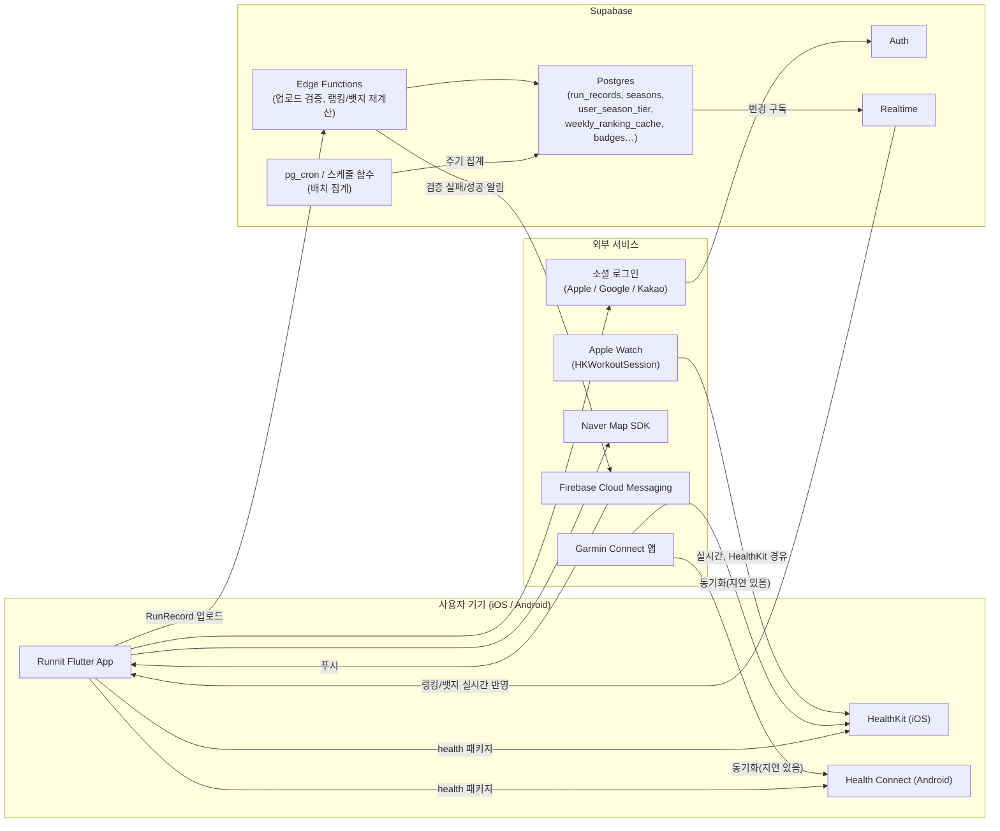
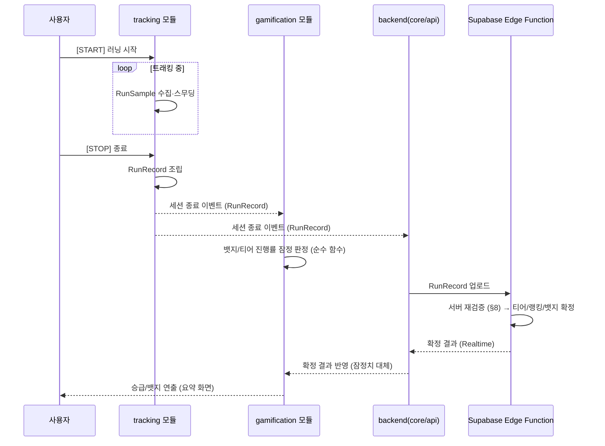
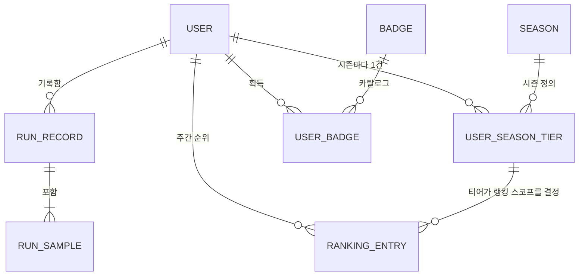
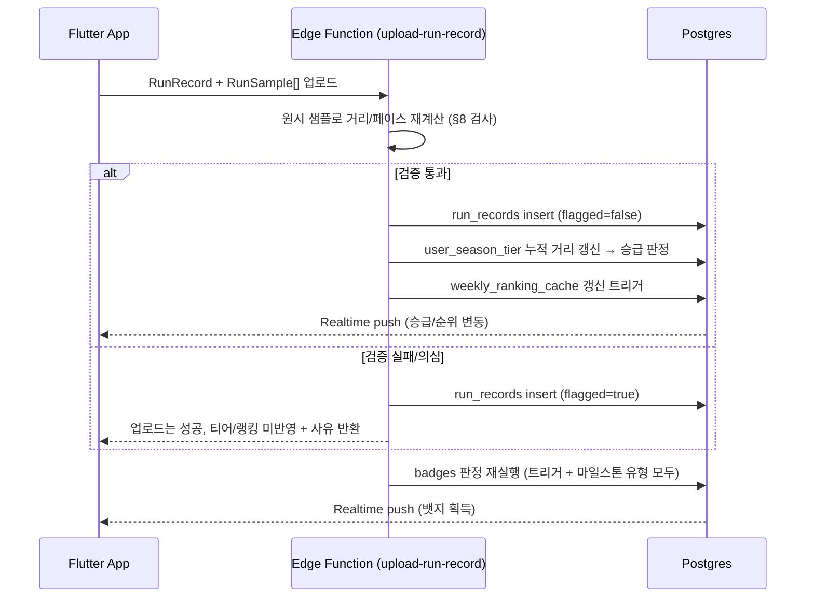
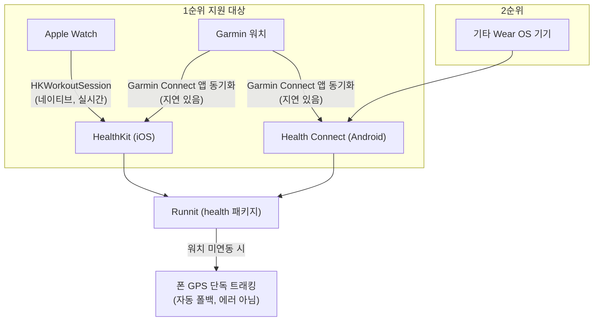
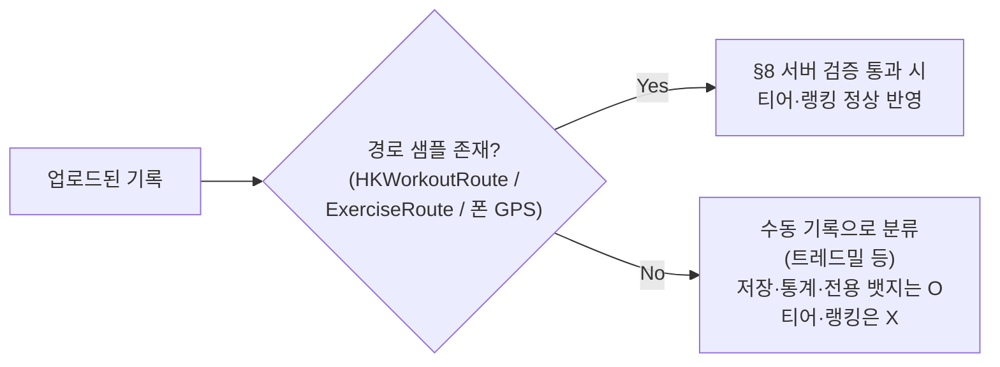
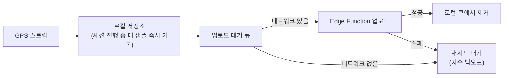

# Runnit 아키텍처 설계서 (Architecture Design Document)

| 항목 | 내용 |
|------|------|
| 문서 버전 | v0.1 (초안) |
| 작성일 | 2026-08-25 |
| 작성자 | jehyun (Claude Code 하네스 산출) |
| 상태 | Phase 0 초안 — 실제 구현 착수 전 검토 필요 |
| 근거 문서 | [`docs/PRD.md`](./PRD.md) v1.3 (확정), `.claude/agents/*`, `.claude/skills/*` (하네스 기술 컨벤션) |
| 하위 문서 | [`docs/TRD.md`](./TRD.md) — 이 문서의 결정을 구현 가능한 스펙으로 세분화 |

**변경 이력**
| 버전 | 변경 내용 |
|------|----------|
| v0.1 | 최초 작성. `claude/phase-0-start` 브랜치에서 구성된 하네스(에이전트 6개·스킬 7개)에 이미 반영되어 있던 아키텍처 결정을 PRD v1.3 기준으로 정리·문서화. PRD §11의 Phase 0 산출물(아키텍처·데이터 모델·Supabase 스키마 확정)에 해당 |

> 📌 **원천 우선순위**: 이 문서와 `docs/PRD.md`가 충돌하면 **PRD가 우선**한다. 이 문서는 PRD의 제품 사양을 구현 구조로 번역한 것이며, 사양 자체를 새로 정의하지 않는다.

---

## 1. 개요

### 1.1 목적
PRD v1.3에서 확정된 기능 요구사항(티어·주간 랭킹·뱃지·GPS 트래킹·웨어러블 연동)을 **구현 가능한 시스템 구조**로 변환한다. 이 문서는 PRD §11 로드맵의 **Phase 0(아키텍처·데이터 모델·Supabase 스키마 확정, 3주/65h)** 산출물이다.

### 1.2 범위
- **P0(MVP) 중심**으로 설계하되, P1(웨어러블 연동)은 데이터 모델 레벨에서 처음부터 수용한다 (PRD §5.7 근거 — 나중에 스키마 마이그레이션 없이 붙는다).
- P2(크루/그룹), Phase 4(포인트 이코노미)는 **테이블/모듈을 지금 만들지 않는다.** 다만 확장을 막지 않는 형태로 경계를 설계한다 (§12).

### 1.3 설계 원칙 (하네스 전반에 이미 합의된 원칙)
1. **데이터 모델이 먼저, 팀 전체가 따른다** — `RunSample`/`RunRecord`가 GPS 트래킹·게이미피케이션·백엔드·UI 네 모듈을 관통하는 단일 기준이다.
2. **폰 GPS와 워치 센서는 소스만 다를 뿐 같은 데이터다** — `RunSample.source`로만 구분하고, 소스별 별도 모델을 만들지 않는다.
3. **클라이언트 계산값은 잠정치, 서버가 최종 판정자다** — 뱃지·티어·랭킹은 반드시 서버(Supabase Edge Function)가 원시 데이터로 재검증한다.
4. **티어(절대평가)와 주간 랭킹(상대평가)은 평가 방식과 집계 주기가 다르므로 테이블·로직을 분리한다** — 하나로 합치면 시즌 리셋과 주간 리셋이 서로를 오염시킨다.
5. **단순함을 기본값으로** — 리더보드는 실시간 전체 재집계 대신 배치 캐시로 시작하고, 필요해지면 트리거/머티리얼라이즈드 뷰로 승격한다.

---

## 2. 시스템 컨텍스트



**핵심 관찰**
- Garmin은 Runnit과 직접 통신하지 않는다. **Garmin Connect → HealthKit/Health Connect → Runnit** 경로를 경유하므로, 아키텍처상 Runnit이 다뤄야 하는 외부 연동 표면은 사실상 **HealthKit/Health Connect 하나**로 수렴한다 (§6.2).
- Supabase가 **단일 백엔드**다. 별도 마이크로서비스를 두지 않고, Postgres + Edge Function + Realtime + pg_cron 조합으로 검증·집계·실시간 반영을 모두 처리한다 — 1인 개발 기준 운영 복잡도를 최소화하기 위한 선택.

---

## 3. 클라이언트 아키텍처 (Flutter)

### 3.1 폴더 구조 — feature-first

레이어 우선(`models/`, `screens/`, `services/`로 전체를 나누는 방식) 대신 **기능 우선** 구조를 쓴다. GPS 트래킹/게이미피케이션/백엔드/UI 담당이 병렬로 작업할 때 레이어 우선 구조는 서로 다른 기능의 코드가 같은 폴더에서 충돌하기 쉽기 때문이다.

```
lib/
  core/                     # 공통 유틸, 라우터(go_router), 테마, DI
    api/                    # Supabase 클라이언트 래퍼
    router/
    theme/
  models/                   # 공유 데이터 모델 — §4 참조 (모든 모듈이 이 모델을 기준으로 함)
    run_sample.dart
    run_record.dart
    user.dart
    badge.dart
    season.dart
    ranking_entry.dart
  features/
    tracking/               # GPS/웨어러블 트래킹 — §6
      data/  domain/  presentation/
    history/                # 기록 히스토리, PB, 시즌 이력(HI-01~09)
      data/  domain/  presentation/
    gamification/           # 뱃지/레벨/티어 판정 로직 — §7
      data/  domain/  presentation/
    ranking/                 # 주간 랭킹 화면 · 명예의 전당
      data/  domain/  presentation/
    profile/                 # 계정/프로필(AC-01~06)
      data/  domain/  presentation/
    sharing/                  # 공유 카드 생성(HI-08, HI-10) — P0
      data/  domain/  presentation/
    notifications/            # 알림 설정/수신(NT-01~08)
```

각 `features/{name}/`은 `data`(외부 연동) / `domain`(비즈니스 로직, 순수 함수) / `presentation`(위젯)으로 나눈다. 이 경계 덕분에 UI 담당은 `presentation/`만, 백엔드 담당은 `data/`만 건드리게 되어 파일 충돌이 줄어든다.

### 3.2 상태관리 — Riverpod

컴파일 타임 안전성과, GPS 스트림처럼 백그라운드에서 갱신되는 상태를 여러 화면이 동시에 구독해야 하는 이 앱의 특성이 Riverpod과 잘 맞는다.

| Provider 유형 | 용도 |
|---|---|
| `StreamProvider` | GPS 위치 스트림, 랭킹 Realtime 구독 |
| `NotifierProvider` | 러닝 세션 상태(진행중/일시정지/종료), 뱃지 획득 큐 |
| `FutureProvider` | 히스토리 조회, 리더보드 1회성 조회 |

### 3.3 모듈 간 인터페이스 원칙

트래킹 모듈은 백엔드·게이미피케이션 모듈에 직접 의존하지 않는다. **`RunRecord`를 스트림/이벤트로 방출**하는 형태로만 노출한다.



이렇게 분리하면 (1) 트래킹 로직을 게이미피케이션과 독립적으로 테스트할 수 있고, (2) 트래킹 소스가 늘어나도(예: 러닝머신 연동) 하위 모듈을 고칠 필요가 없다.

---

## 4. 핵심 데이터 모델

> 상세 필드 스펙(Dart 클래스 정의)은 [`docs/TRD.md`](./TRD.md) §3 참조. 여기서는 모델의 **책임과 관계**만 정리한다.

| 모델 | 책임 | 비고 |
|---|---|---|
| `RunSample` | 단일 GPS/센서 포인트 (위치·시간·선택적 심박수) | **폰/워치 공통.** `source: phone \| watch` 필드로만 구분 |
| `RunRecord` | 완결된 러닝 세션 (샘플 목록 + 집계값) | 티어·랭킹·뱃지의 **원천 데이터** |
| `User`(`Profile`) | 프로필, 누적 통계 캐시 | 캐시 필드 포함 여부는 배치 재계산 비용과 트레이드오프 (§5.3) |
| `Season` | 분기 시즌 정의 (시작/종료 시각) | PRD §8.5 — 역년 분기 |
| `UserSeasonTier` | 사용자별 **시즌 누적 거리 + 현재 티어** | 절대평가. `Season`과 N:1 |
| `RankingEntry`(`WeeklyRankingCache`) | 티어 내 주간 순위 스냅샷 | 상대평가. 매주 리셋, `Season`과 무관하게 주 단위로 존재 |
| `Badge` / `UserBadge` | 뱃지 카탈로그 / 획득 기록 | `verified` 플래그로 서버 재검증 상태 표시 |
| `Challenge` (P1) | 개인 기간 한정 목표 | MVP 범위 밖이나 모델 확장 지점만 남겨둠 |

### 4.1 관계도



**왜 `UserSeasonTier`와 `RankingEntry`를 분리하는가 (PRD §5.3~§5.4 핵심 결정)**
- 티어는 **시즌(3개월) 단위 절대평가**, 랭킹은 **주(1주) 단위 상대평가**다. 집계 주기와 리셋 시점이 다른 두 개념을 하나의 테이블/모델에 넣으면, 주간 리셋 로직이 시즌 누적값을 실수로 건드리는 사고가 나기 쉽다.
- `RankingEntry`는 `UserSeasonTier.currentTier`를 **파티션 키**로 참조한다 — "같은 티어 내에서만 순위를 매긴다"는 PRD §5.4의 원칙이 데이터 모델 레벨에서 강제된다.
- 주중 승급 시(PRD §8.6) `RankingEntry`의 주간 누적 거리는 **그대로 유지한 채 파티션 키(티어)만 갱신**한다 — 재초기화하지 않는다.

---

## 5. 백엔드 아키텍처 (Supabase)

### 5.1 구성 요소

| 구성 요소 | 역할 |
|---|---|
| **Postgres** | 단일 진실 원천 — 기록/시즌/티어/랭킹/뱃지 테이블 |
| **Auth** | 소셜 로그인(Apple/Google/Kakao) 세션 관리, `auth.users` |
| **Edge Functions** | (1) 업로드 시 서버 재검증, (2) 뱃지/티어 판정 재계산, (3) 랭킹 배치 집계 |
| **Realtime** | `weekly_ranking_cache`, `user_badges` 변경을 클라이언트에 push |
| **pg_cron / 스케줄 함수** | 주기적 랭킹 캐시 갱신, 시즌 경계 배치 작업(D-14/D-3 알림 트리거 등) |

### 5.2 기록 업로드 → 검증 → 집계 파이프라인



이 파이프라인이 PRD §8.4("클라이언트 계산값을 신뢰하지 않고 서버에서 원본 샘플로 재계산")를 아키텍처로 구현한 것이다. 클라이언트는 **잠정 결과를 먼저 보여주고**, 서버 확정 결과가 Realtime으로 도착하면 교체한다(낙관적 UI).

### 5.3 티어·랭킹 집계 전략

사용자 수가 늘면 매 조회마다 `run_records`를 전체 집계하는 쿼리는 느려진다. 초기 규모에서는 **배치 캐시**를 기본값으로 한다:

1. **1단계(초기, 기본값)**: `weekly_ranking_cache` 테이블을 Edge Function + `pg_cron`으로 주기 갱신(예: 5분). 구현이 단순하고 리더보드 조회 1초 이내(PRD §6) 요구를 쉽게 만족.
2. **2단계(필요 시 승급)**: `run_records` insert 트리거로 해당 사용자의 순위만 증분 재계산 — 실시간성이 더 필요해질 때.
3. **3단계(규모 확대 시)**: 머티리얼라이즈드 뷰 — 다중 스코프(주간/시즌/명예의 전당 등)로 늘어날 때.

`UserSeasonTier.currentDistance`(시즌 누적)는 **승급 판정에 지연이 없어야 하므로**(PRD TI-03 "기록 저장 즉시 판정") 캐시가 아니라 업로드 트랜잭션 내에서 즉시 갱신한다. 반면 `weekly_ranking_cache`(주간 순위)는 사용자 체감상 약간의 지연(수 분)이 허용되므로 배치로 처리한다 — **같은 파이프라인 안에서도 티어는 동기, 랭킹은 비동기**로 분리하는 것이 핵심 설계 결정이다.

### 5.4 실시간 동기화

`weekly_ranking_cache`, `user_season_tier`, `user_badges` 변경을 Supabase Realtime으로 구독한다. 단, 랭킹 캐시가 배치(5분 등)로 갱신된다면 실시간 구독의 체감 효과는 제한적이므로, **"마지막 갱신 시각"을 UI에 노출**해 사용자가 지연을 인지하게 한다.

### 5.5 RLS 정책 원칙

| 테이블 | 정책 |
|---|---|
| `run_records`, `run_samples` | insert/update는 `user_id = auth.uid()`만, select도 본인만 (랭킹 공개는 캐시 테이블을 통해) |
| `weekly_ranking_cache`, `user_season_tier`(공개 필드만) | 전체 select 허용, insert/update는 service role(Edge Function)만 |
| `user_badges` | select는 본인 것만(타인 프로필 조회는 AC-03 별도 API로 공개 범위 필터링), insert는 service role만 |

세부 DDL·RLS 문구는 [`docs/TRD.md`](./TRD.md) §4~§5 참조.

---

## 6. GPS·웨어러블 트래킹 아키텍처

### 6.1 전체 흐름

```
권한 요청(단계적) → 위치 스트림 시작(포그라운드 서비스)
  → 원시 RunSample 수집 → 스무딩/이상치 제거
  → 거리·페이스·칼로리 계산 → RunRecord 조립 → 세션 종료 이벤트 발행
```

권한은 한 번에 "항상 허용"을 요청하지 않고 단계적으로 요청한다(iOS/Android 모두 일괄 요청 시 거부율 상승): (1) 앱 사용 중 위치 권한 → (2) 러닝 시작 시점에 "항상 허용" 승격 → (3) 웨어러블 연동은 Health Connect/HealthKit 권한을 별도 플로우로 요청.

### 6.2 웨어러블 연동 경로



**핵심 설계 판단**: Garmin은 별도 SDK 통합이 아니라 **HealthKit/Health Connect 연동의 부산물**로 지원된다. iOS의 HealthKit, Android의 Health Connect 연동을 한 번 구현하면 Apple Watch·Garmin·기타 Wear OS 세 갈래를 하나의 코드 경로로 커버한다. Garmin 전용 실시간 연동(Garmin Health API, 개발자 승인 필요)은 MVP에서 다루지 않고 후속 검토로 남긴다.

### 6.3 티어·랭킹 반영 판정 — 기기가 아니라 경로 데이터 유무 (PRD §5.7 확정)



이 판정은 `RunRecord`에 파생 필드(예: `hasRouteSamples: bool`)로 명시하며, 기기 종류(`source`)가 아니라 **샘플 존재 여부**로 분기한다 — 워치 사용자를 차별하지 않으면서 검증 구멍도 만들지 않는다.

### 6.4 GPS 스무딩

원시 GPS 좌표는 실내/도심에서 수 미터~수십 미터 벗어난 값을 반환할 수 있다. 스무딩 없이 연속 좌표 간 직선거리를 그대로 누적하면 **정지 상태에서도 거리가 계속 증가하는 버그**가 생긴다. 이동평균 또는 Kalman filter로 이상치를 제거한 뒤 Haversine 공식으로 거리를 누적한다. 순간 속도 25km/h 초과 구간은 §8 서버 검증과 동일 기준으로 클라이언트 단계에서도 1차 필터링한다.

### 6.5 배터리 최적화

| 모드 | 정확도 | 폴링 주기 | 용도 |
|---|---|---|---|
| 고정밀 | best | 1~2초 | 대회/기록 갱신용 |
| 표준 | high | 5초 | 일반 러닝 |
| 절전 | medium | 10초+ | 장거리(마라톤) |

PRD §6 "1시간 러닝 시 배터리 소모 10% 이하" 요구는 **표준 모드를 기본값**으로 설정하고, 배경 트래킹 시 불필요한 화면 렌더링·네트워크 폴링을 차단하는 것으로 충족을 목표한다.

---

## 7. 게이미피케이션 아키텍처

### 7.1 판정 이원 트리거

뱃지 판정은 두 경로를 모두 구독해야 마일스톤형 뱃지 누락을 막는다.

| 트리거 | 예시 | 구독 위치 |
|---|---|---|
| 세션형 | 첫 러닝, 새벽 러닝(오전 6시 이전 시작) | 러닝 세션 종료 이벤트 |
| 누적형 | 누적 100km, 30일 연속 러닝, 티어 승급 | 누적 통계/티어 갱신 이벤트 |

### 7.2 클라이언트-서버 판정 미러링

게이미피케이션 판정 로직(뱃지 조건, 랭킹 산정)은 **순수 함수**로 작성한다 — 입력(RunRecord, 누적 통계)만으로 출력(획득 뱃지, 승급 여부)이 결정되고 부수효과가 없다. 이렇게 하면 클라이언트의 잠정 판정 로직을 백엔드 Edge Function이 그대로 이식하거나 참조해 **동일한 규칙으로 재검증**할 수 있다. 규칙이 클라이언트/서버에서 따로 구현되면 (예: 임계값 오타 하나로) 두 결과가 어긋나는 버그가 조용히 누적된다.

### 7.3 티어 vs 주간 랭킹 — 아키텍처 레벨 재확인

| | 티어 | 주간 랭킹 |
|---|---|---|
| 평가 방식 | 절대평가 (기준선 돌파) | 상대평가 (티어 내 순위) |
| 집계 주기 | 시즌(3개월) 누적, **판정은 즉시** | 주(1주), **집계는 배치 허용** |
| 강등 | 시즌 중 없음 | 매주 리셋(그 자체가 리셋) |
| 데이터 소유 모델 | `UserSeasonTier` | `RankingEntry`/`WeeklyRankingCache` |
| 인원 불균형 대응 | 해당 없음(개인 단위 절대 판정) | 매칭 로직 미도입 — "격차 우선, 상위% 병기"로 표시만 완화 (PRD §5.4.1) |

⚠️ 이 표를 벗어나 두 개념을 하나의 서비스/테이블로 합치는 구현은 **아키텍처 원칙 위반**으로 간주한다.

---

## 8. 부정행위 방지 파이프라인 (Anti-cheat)

PRD §8.4의 검사 항목을 업로드 파이프라인의 어느 단계에서 수행하는지 정리한다 (구체 임계값·SQL은 TRD §7).

| 검사 | 수행 위치 | 실패 시 조치 |
|---|---|---|
| 비현실적 평균 페이스 | Edge Function (원본 샘플 재계산) | 티어·랭킹 제외 + `flagged=true` |
| 순간 속도 이상(구간 25km/h 초과) | Edge Function | 해당 구간 제거 후 재계산 |
| 시간 대비 거리 불일치 | Edge Function | 기록 거부(4xx 응답) |
| 중복 업로드(동일 시간대) | Edge Function → DB unique 제약 보조 | 병합 또는 거부 |
| GPS 샘플 부재 | 업로드 시점 판정 | 수동 기록으로 분류(§6.3) |
| 경로 비현실성(직선/순간 이동) | Edge Function | 플래그 후 수동 검토 큐 적재 |
| 다계정 의심 | Phase 4 대상 | 포인트 적립 보류(현재는 로깅만) |

**원칙**: 의심 기록은 **삭제하지 않고 `flagged`로만 표시**한다 — 오탐 가능성이 있으므로 이의 제기 시 근거 데이터가 남아있어야 한다(PRD §8.4).

---

## 9. 오프라인 우선 동기화 전략

PRD TR-08("오프라인 기록 → 복귀 시 자동 동기화", 100% 업로드)과 비기능 요구사항 "트래킹 중 크래시로 인한 기록 손실 0건"을 만족하기 위한 구조:



- 트래킹 중에는 인메모리가 아니라 **로컬 영속 저장소에 매 샘플을 즉시 기록**한다 — 앱 크래시 시에도 세션 복구가 가능해야 하기 때문이다. 저장소 선택(Hive/Drift/Isar 등)은 TRD §14 미확정 항목.
- 업로드 큐는 세션 단위(`RunRecord` 전체)로 관리하며, 부분 업로드로 인한 정합성 문제를 피하기 위해 하나의 트랜잭션으로 전송한다.

---

## 10. 비기능 요구사항 대응 매핑

| PRD §6 요구사항 | 목표 | 담당 아키텍처 요소 |
|---|---|---|
| GPS 거리 오차 | ±3% 이내 | §6.4 스무딩 + Haversine, §8 서버 재계산 |
| 배터리 소모 | 1시간 10% 이하 | §6.5 배터리 모드, 백그라운드 렌더링 최소화 |
| 콜드 스타트 | 3초 이내 | Riverpod 지연 초기화, 초기 라우트 최소 의존성 |
| 랭킹 조회 | 1초 이내 | §5.3 배치 캐시(`weekly_ranking_cache`) |
| 기록 손실 | 0건 | §9 로컬 영속 저장 + 업로드 큐 |
| 오프라인 | 트래킹·저장 가능, 복귀 시 동기화 | §9 |
| 티어·랭킹 정합성 | 서버가 단일 진실 원천 | §5.2, §7.2, §8 |
| 플랫폼 | iOS 15+ / Android 8.0+ | `health`, `geolocator` 등 패키지 최소 지원 버전 확인(TRD §2) |

---

## 11. 모듈 책임 매트릭스

| 모듈(`features/`) | 담당 하네스 에이전트 | 주요 산출물 위치 |
|---|---|---|
| 프로젝트 구조/데이터 모델 전반 | `mobile-architect` | `lib/models/`, `lib/core/` |
| `tracking/` | `gps-tracking-engineer` | `lib/features/tracking/` |
| `gamification/`, `ranking/` 도메인 로직 | `gamification-designer` | `lib/features/gamification/` |
| Supabase 스키마/RLS/API | `backend-engineer` | Supabase 마이그레이션, `lib/core/api/` |
| `presentation/` 전반(UI) | `flutter-ui-designer` | 각 feature의 `presentation/` |
| 경계면 정합성 검증 | `qa-integration-tester` | 각 모듈 완성 직후 |

---

## 12. 미확정 아키텍처 결정 (Open Items)

| # | 이슈 | 현재 판단 | 확정 시점 |
|---|---|---|---|
| 1 | 로컬 영속 저장소 (Hive / Drift / Isar / sqflite) | 미정 — §9 오프라인 큐 구현 시 결정 | Phase 1 착수 시 |
| 2 | 지도 SDK 클라이언트 패키지 | PRD상 Naver Map 확정(`flutter_naver_map`), 실제 API 키/쿼터 검증 필요 | Phase 1 |
| 3 | 공유 카드(HI-08) 이미지 생성 방식 (클라이언트 렌더링 vs 서버 렌더링) | 클라이언트 렌더링(위젯 캡처) 우선 검토 — 서버 비용·지연 없음 | Phase 2 |
| 4 | `run_samples` 저장 방식 (jsonb 컬럼 vs 별도 테이블) | 초기엔 `run_records.samples jsonb`, 샘플 수 많아지면 별도 테이블 분리 검토 | Phase 1, 실측 후 |
| 5 | P2(크루)·Phase 4(포인트) 스키마 확장 여지 | 지금 테이블을 만들지 않되, `RunRecord.userId` 등 기존 FK 구조가 그룹 스코프 추가를 막지 않는지만 확인 | 해당 Phase 착수 시 |

---

## 13. 다음 단계

1. 이 문서의 데이터 모델(§4)을 [`docs/TRD.md`](./TRD.md)에서 실제 Dart `freezed` 클래스와 Supabase DDL로 구체화한다.
2. `mobile-architect` 에이전트가 `lib/models/*.dart` 실 코드를 생성하고, `backend-engineer`가 대응 마이그레이션을 적용한다(Phase 0 완료 기준은 TRD §13).
3. Phase 1(P0 전반: GPS 트래킹, 기록 저장/히스토리, 계정) 착수.
