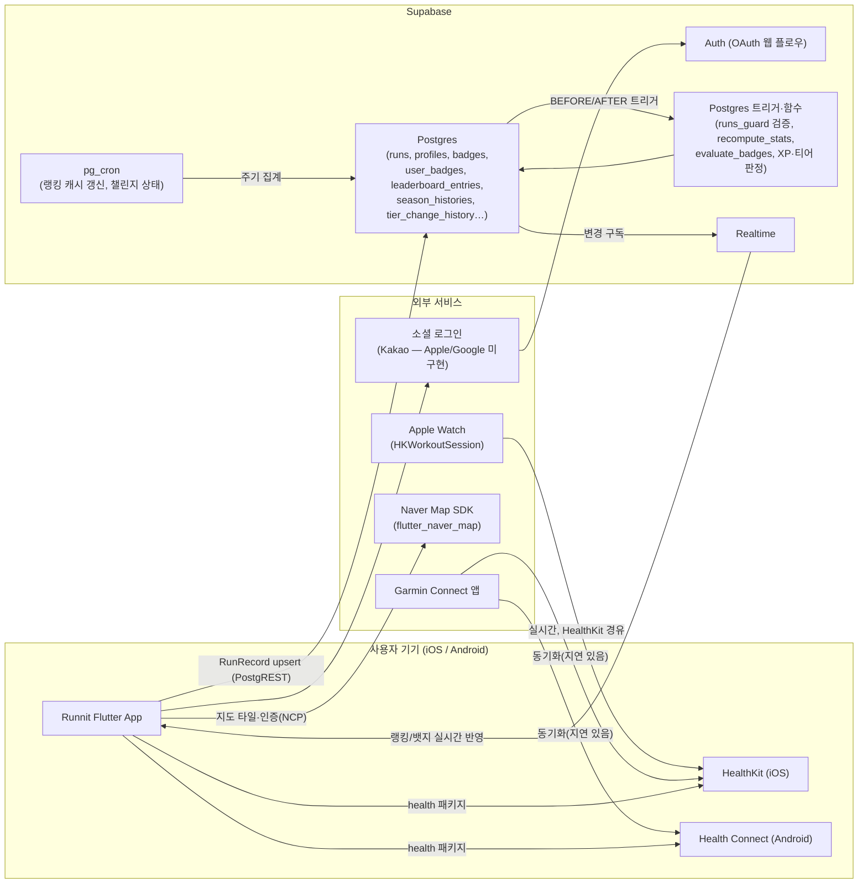
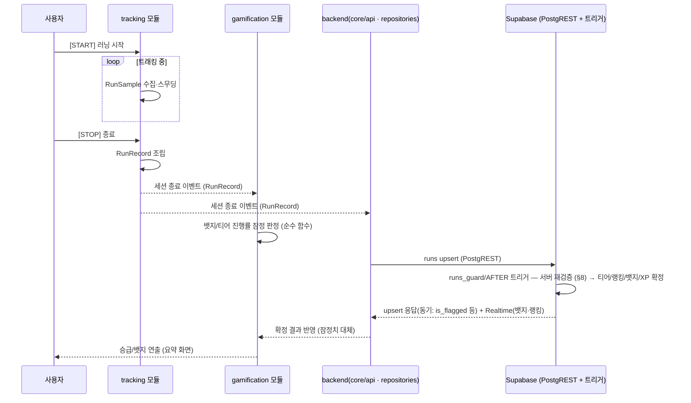
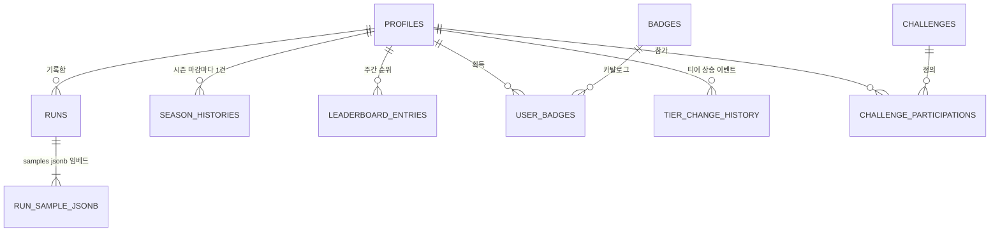
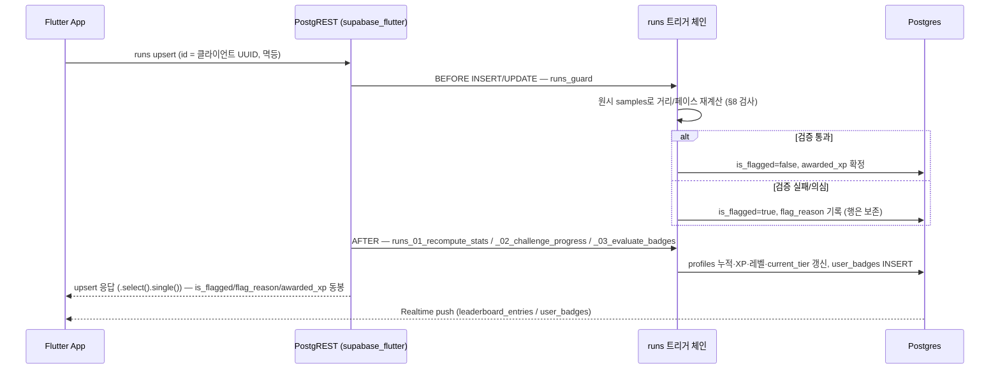
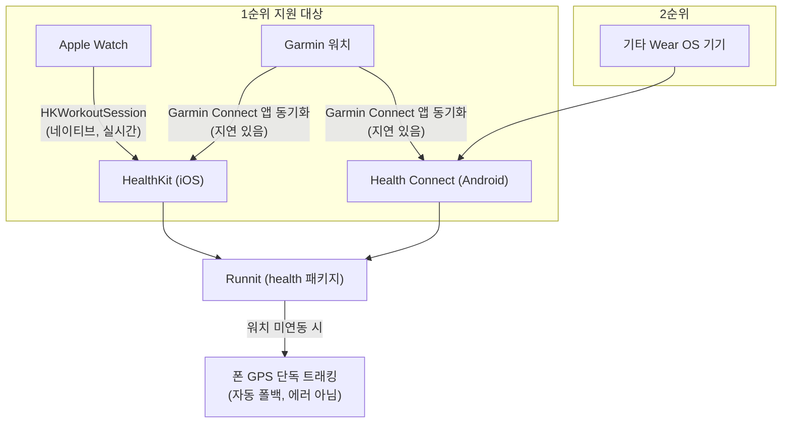
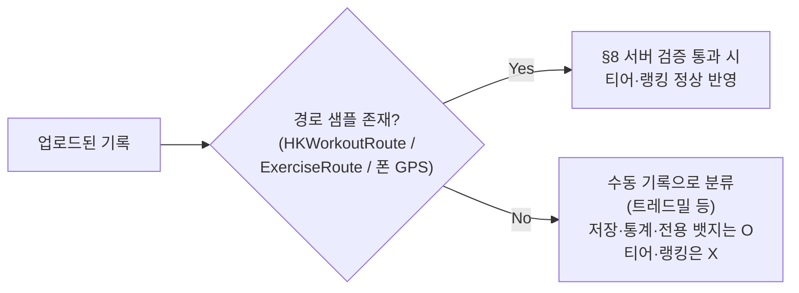
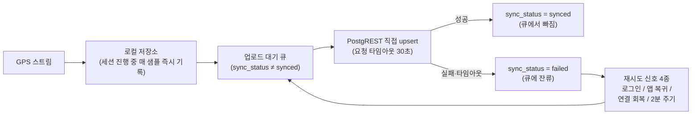

# Runnit 아키텍처 설계서 (Architecture Design Document)

| 항목 | 내용 |
|------|------|
| 문서 버전 | v0.12 |
| 작성일 | 2026-08-27 |
| 작성자 | jehyun (Claude Code 하네스 산출) |
| 상태 | **살아있는 문서 — 구현 반영본.** Phase 0 산출물로 출발했으나 현재는 실제 코드(`lib/`, `supabase/migrations/`)를 따라간다. 구현이 발전하면 이 문서를 갱신한다(CLAUDE.md 규칙 3) |
| 근거 문서 | [`docs/PRD.md`](./PRD.md) v1.5 (확정), 실제 구현(`lib/`, `supabase/migrations/00~42`) |
| 하위 문서 | [`docs/TRD.md`](./TRD.md) — 이 문서의 결정을 구현 가능한 스펙으로 세분화 |

**변경 이력**
| 버전 | 변경 내용 |
|------|----------|
| v0.1 | 최초 작성. `claude/phase-0-start` 브랜치에서 구성된 하네스(에이전트 6개·스킬 7개)에 이미 반영되어 있던 아키텍처 결정을 PRD v1.3 기준으로 정리·문서화. PRD §11의 Phase 0 산출물(아키텍처·데이터 모델·Supabase 스키마 확정)에 해당 |
| v0.13 | **TR-08 오프라인 동기화 QA 후속**(2026-09-01, A-5). §9 전면 갱신: (1) 다이어그램의 "지수 백오프"는 **사실이 아니었다** — 실제 전략은 고정 2분 주기 + 이벤트 신호이고, 여기에 연결 회복 감지(`connectivity_plus`)를 더해 4신호로 정리. (2) 요청 타임아웃 30초(`LocalRunRepository.uploadTimeout`) 도입 — 스탈된 연결 하나가 코디네이터 재진입 래치를 걸어 큐를 앱 수명 내내 정지시키던 문제(QA C-3). (3) `save()`는 로컬 저장까지만 await하고 업로드는 fire-and-forget — 러닝 종료 요약 화면이 서버 응답에 묶이지 않는다(C-4). (4) `syncPending(userId:)` 계정 필터(C-5). (5) 백그라운드 동기화 부재를 명시적 전제로 기록(C-9). **§9.1 신설 — 경계를 넘긴 지각 업로드는 현 시즌·현 주에만 귀속하고 마감된 과거는 소급 변경하지 않는다(정책 확정, C-1·C-2)** |
| v0.2 | **성취 축하 구조를 "두 소비 지점 + 억제 카운터"에서 "전역 풀페이지 단일 지점"으로 갱신**(§7.4.1, PRD v1.4·TRD §3.9.3). 요약 화면 인라인 축하와 `achievementCelebrationSuppressors`를 제거하고 `AchievementCelebrationHost` 하나가 항상 풀페이지(`rootNavigator` + `fullscreenDialog`)로 축하한다. 공유 카드(§3.1 파일 트리)도 같은 날 9:16 투명 오버레이로 최종 확정된 상태를 반영 |
| v0.3 | **"Phase 0 초안"에서 "구현 반영 살아있는 문서"로 승격.** Phase 1~2 구현이 진행되면서 확정된 사실을 반영: (1) **백엔드는 Deno Edge Function을 쓰지 않는다** — 업로드는 `supabase_flutter`의 PostgREST 직접 upsert이고, 서버 검증·티어/랭킹/뱃지 판정·XP는 전부 **Postgres 트리거·함수**(마이그레이션 00~42)다(§2, §5, §8). (2) ~~지도는 `flutter_map`(OSM 타일)~~ — **v0.4에서 `flutter_naver_map`으로 교체돼 해소됨**(§12-#2). (3) **로컬 저장소 = drift 확정**(§9, §12-#1). (4) `run_samples`는 별도 테이블이 아니라 `runs.samples jsonb`로 확정(§12-#4). (5) 시즌은 `seasons` 테이블 대신 순수 계산 함수(`Season.idAt` / SQL `season_id_at`). 데이터 모델 필드 상세는 TRD §3 대신 `lib/models/*.dart`가 정본 |
| v0.4 | **지도 SDK를 `flutter_map`(OSM 타일) → `flutter_naver_map`으로 교체**(2026-08-28, 사용자 결정). PRD §7과의 불일치(§12-#2)가 해소됐다. 앱 내부 표준 좌표 모델은 `latlong2`의 `LatLng`를 그대로 유지하고 (`share_card_builder`·`polyline_codec`·집계·히스토리 provider가 전부 이 타입에 묶여 있다), **지도 위젯 경계에서만** `NLatLng`로 변환한다(`lib/core/map/map_geo.dart`). 글로벌 확장 시 재교체 여지를 위해 지도 표면 생성을 `mapSurfaceBuilderProvider` 하나(`lib/core/map/map_surface.dart`)로 모아 격리했다 — 위젯 테스트도 이 주입점을 스텁으로 override한다(구 `mapTileProviderOverride` 제거). OSM 전용 `core/widgets/osm_attribution.dart`는 삭제 — 네이버 SDK가 로고·저작권을 자체 렌더하므로 일시정지 딤도 전면 오버레이 대신 지도 `lightness`로 처리해 로고를 가리지 않는다 |
| v0.5 | **러닝·뱃지 삭제 불가 + 시즌 중 티어 강등 없음**(PRD v1.6, 2026-08-28, 마이그레이션 43). §7.3 표의 "강등" 행을 "시즌 내 절대 없음 — `current_tier` 단조 증가"로 강화. 부정 기록 무효화(`is_flagged`)로 `season_distance_meters`가 줄어도 `recompute_season_tier`가 같은 시즌이면 `greatest(신규, 직전)`로 티어를 유지한다. §13의 HI-07을 "수정만, 삭제 스펙 제거"로 갱신. §5 §7.4의 "before/after 비교는 시즌 롤오버를 강등으로 오인" 서술은 그대로 유효(시즌 경계 하드 리셋은 남아 있음) |
| v0.6 | **HI-07 서버 강제 — 저장된 러닝은 제목·메모만 수정 가능**(마이그레이션 51, 2026-08-31, 미적용·사용자 검토 대기). v1.6은 *삭제*만 막았을 뿐 멱등 upsert가 열어 둔 **UPDATE 경로**가 남아 있었다 — 3km를 저장한 뒤 42km로 UPDATE하면 파생값이 재계산되면서 티어·랭킹·뱃지가 그대로 따라 올라갔다. `runs_guard`의 UPDATE 분기가 터미널 상태 행을 `new := old` 후 `title`/`note`만 재적용하도록 바뀌면서 이 경로가 닫혔다(§5.2). 예외 대신 "되돌리기"를 택한 이유는 오프라인 큐의 멱등 재 upsert를 깨지 않기 위함. RLS `runs_delete_own` 정책 삭제 — 테이블 GRANT는 유지한다(회수하면 미완결 세션 "버리기"가 42501로 실패). §5.5 표 `runs` 행·§13-1 갱신. 상세 스펙은 TRD §4.4 |
| v0.8 | **HI-06 QA 후속**(2026-08-31) — (1) §5.5 RLS 표의 `season_histories` 서술 정정: "본인 행만 select"가 아니라 `is_voided=false`면 타인 행도 `authenticated` 공개(`season_histories_select_visible`, 마이그레이션 21) — TI-09/AC-03이 이 공개 범위를 재사용한다. `tier_change_history`와 분리. (2) 마이그레이션 52 — `recompute_season_tier`의 `best_weekly_rank` 서브쿼리에 `and le.tier is not null`(통합 보드 제외), 상세는 TRD §9·§14. **원격 적용 완료**(2026-08-31) |
| v0.9 | **AC-02/AC-03 백엔드**(마이그레이션 53~55, 2026-08-31, **미적용 — 사용자 승인 대기**). §5.5 RLS 표에 세 행 추가: (1) `profiles` 편집 컬럼 — `weekly_goal_km` 신설, 그리고 `trg_profiles_guard`가 `runs` 가드와 달리 **블랙리스트**라 신설 컬럼의 기본값이 "사용자 편집 가능"이라는 함정 명시. (2) `storage.objects`/`avatars` 버킷 — 읽기 공개, 쓰기는 `{uid}/` 폴더 한정, 용량·MIME은 버킷 설정. (3) `user_badges` 공개 select 정책의 **스키마 드리프트 정정** — 표가 서술하던 "타인은 `verified and not revoked`"는 원격 DB에 정책으로 살아 있었지만 마이그레이션 파일에는 없었다(적용 이력은 52에서 끝난다). 원격만 맞고 새 환경은 틀린 상태여서, 라이브와 동일한 술어로 파일화했다 — 원격 적용은 no-op. 부수효과로 Realtime 구독 필터가 유일한 방어선이 된다. `runs` RLS는 손대지 않았다 — AC-03은 타인의 러닝 목록을 노출하지 않는다. 상세는 TRD §4.5·§5 |
| v0.12 | **마이그레이션 53~56 원격 적용 완료**(2026-08-31). 54 의 `storage.objects` 정책 4종은 owner 권한 문제로 `execute_sql` 경로로 적용(이력 밖, 파일엔 있음). advisor 신규 경보 없음 |
| v0.11 | **AC-02/03 QA 수정**(2026-08-31, 마이그레이션 56). F-2 `username` 서버 강제 고정: `trg_profiles_guard`가 UPDATE 시 `new.username := old.username`(PK와 동급). 블랙리스트 가드라 클라만 막던 핸들이 REST 직접 호출로 변조 가능했던 것. §5.5 `profiles` 행 갱신 |
| v0.10 | **AC-05(공개 범위) 삭제**(PRD v1.7, 2026-08-31). §13-3에서 AC-02/03을 "백엔드 완료·클라 진행"으로, AC-05를 "삭제"로 갱신. `profiles`는 예전부터 전체 공개였고 비공개 분기를 새로 만들지 않는다 |
| v0.7 | **역대 시즌 기록 화면(HI-06) 프런트 연결 완료**(2026-08-31). 백엔드(마이그레이션 21·22)는 이미 있었고 소비하는 화면만 없었다 — `SeasonHistoryRepository`(읽기 전용, `season_id desc`) + `mySeasonHistoriesProvider` + `SeasonHistoryPage`. 리포지토리에 write 경로를 두지 않은 이유: `season_histories`는 시즌 경계에서 서버만 쓰고 마감 후엔 서버도 고치지 않는다. 무효 시즌(`is_voided`)은 목록에서 **감추지 않고** 흐리게+라벨로 표시(§8.1 이의 제기 근거 보존). TI-09(역대 최고 티어)는 무효·진행 중 시즌을 제외한 파생값으로 목록 상단에 노출. 라우트 `/seasons`는 알림함과 같이 **마이 탭 브랜치** 소속이라 다른 탭에서는 `push` 대신 `MaterialPageRoute`로 띄운다. §13-4 갱신 |

> 📌 **원천 우선순위**: 이 문서와 `docs/PRD.md`가 충돌하면 **PRD가 우선**한다. 이 문서는 PRD의 제품 사양을 구현 구조로 번역한 것이며, 사양 자체를 새로 정의하지 않는다.

---

## 1. 개요

### 1.1 목적
PRD에서 확정된 기능 요구사항(티어·주간 랭킹·뱃지·GPS 트래킹·웨어러블 연동)을 **구현된 시스템 구조**로 서술한다. Phase 0 산출물로 출발했고, 지금은 실제 코드(`lib/`, `supabase/migrations/`)와 어긋나지 않도록 유지하는 살아있는 문서다. 필드 단위 스펙은 `lib/models/*.dart`가, 스키마 단위 스펙은 마이그레이션 파일이 정본이다.

### 1.2 범위
- **P0(MVP) 중심**으로 설계하되, P1(웨어러블 연동)은 데이터 모델 레벨에서 처음부터 수용한다 (PRD §5.7 근거 — 나중에 스키마 마이그레이션 없이 붙는다).
- P2(크루/그룹), Phase 4(포인트 이코노미)는 **테이블/모듈을 지금 만들지 않는다.** 다만 확장을 막지 않는 형태로 경계를 설계한다 (§12). — 단 `crew_id`/`ranking_scope='crew'`/`challenges` 등 일부 확장 지점은 이미 모델·enum에 자리만 잡혀 있다.

### 1.3 설계 원칙 (하네스 전반에 이미 합의된 원칙)
1. **데이터 모델이 먼저, 팀 전체가 따른다** — `RunSample`/`RunRecord`가 GPS 트래킹·게이미피케이션·백엔드·UI 네 모듈을 관통하는 단일 기준이다.
2. **폰 GPS와 워치 센서는 소스만 다를 뿐 같은 데이터다** — `RunSample.source`로만 구분하고, 소스별 별도 모델을 만들지 않는다.
3. **클라이언트 계산값은 잠정치, 서버가 최종 판정자다** — 뱃지·티어·랭킹은 반드시 서버(Postgres 트리거·함수)가 원시 데이터로 재검증한다.
4. **티어(절대평가)와 주간 랭킹(상대평가)은 평가 방식과 집계 주기가 다르므로 테이블·로직을 분리한다** — 하나로 합치면 시즌 리셋과 주간 리셋이 서로를 오염시킨다.
5. **단순함을 기본값으로** — 리더보드는 실시간 전체 재집계 대신 배치 캐시로 시작하고, 필요해지면 트리거/머티리얼라이즈드 뷰로 승격한다.

---

## 2. 시스템 컨텍스트



**핵심 관찰**
- Garmin은 Runnit과 직접 통신하지 않는다. **Garmin Connect → HealthKit/Health Connect → Runnit** 경로를 경유하므로, 아키텍처상 Runnit이 다뤄야 하는 외부 연동 표면은 사실상 **HealthKit/Health Connect 하나**로 수렴한다 (§6.2).
- Supabase가 **단일 백엔드**다. 별도 마이크로서비스도, **Deno Edge Function도 두지 않는다.** 클라이언트는 `supabase_flutter`로 `runs` 등에 직접 upsert하고, 서버 검증·티어/랭킹/뱃지/XP 판정은 전부 **Postgres 트리거·함수**(마이그레이션 00~42)가 같은 트랜잭션 또는 `pg_cron` 배치로 처리한다 — 1인 개발 기준 운영 복잡도를 최소화하기 위한 선택. (이 문서 곳곳에 남아 있는 "Edge Function" 서술은 초기 설계 표현이며, 실제 구현 위치는 트리거/함수다.)
- **푸시(FCM)는 서버·클라이언트 모두 구현됐다**(마이그레이션 44~48 + `lib/core/notifications/`·`lib/features/notifications/`, 2026-08-28). 남은 것은 운영 설정뿐이다 — FCM 프로젝트·서비스 계정, `google-services.json`/`GoogleService-Info.plist`, Vault 시크릿 2개, `push-dispatch` 배포. 설정 파일이 없으면 `Firebase.initializeApp()`이 실패해도 앱은 그대로 뜨고 푸시만 꺼진다(`core/notifications/firebase_bootstrap.dart`). **Apple/Google 로그인(AC-01)은 여전히 미착수** — 로그인은 카카오 OAuth 웹 플로우(`signInWithOAuth`)만 동작한다.
- **지도는 `flutter_naver_map`이다. PRD §7과 일치한다.** 앱 내부 좌표는 `latlong2`의 `LatLng`로 유지하고, 지도 위젯 경계(`lib/core/map/`)에서만 `NLatLng`로 변환한다. NCP 클라이언트 ID는 `initializeNaverMap()`(`lib/core/map/naver_map_config.dart`)에서 주입한다.

---

## 3. 클라이언트 아키텍처 (Flutter)

### 3.1 폴더 구조 — feature-first

레이어 우선(`models/`, `screens/`, `services/`로 전체를 나누는 방식) 대신 **기능 우선** 구조를 쓴다. GPS 트래킹/게이미피케이션/백엔드/UI 담당이 병렬로 작업할 때 레이어 우선 구조는 서로 다른 기능의 코드가 같은 폴더에서 충돌하기 쉽기 때문이다.

```
lib/
  core/                     # 공통 유틸, 라우터(go_router), 테마, DI
    api/                    # Supabase 클라이언트 래퍼, wire_enums, realtime_refetch
    auth/                   # 카카오 OAuth 플로우, auth_controller/state/config
    config/  error/  providers/  theme/  utils/  widgets/
    map/                    # 지도 SDK 경계 — map_surface(표면 주입점·공용 스타일),
                            #   map_geo(latlong2 LatLng ↔ NLatLng 변환),
                            #   naver_map_config(NCP 클라이언트 ID·초기화)
    repositories/           # run/user/ranking/gamification 리포지토리 인터페이스
    router/                 # app_router, route_access
    sync/                   # run_sync_coordinator — 오프라인 큐 동기화
  models/                   # 공유 데이터 모델 — 필드 정본은 이 파일들 (freezed)
    enums.dart              # 전 enum 집약 (RunSampleSource/DeviceVendor/Tier/BadgeCategory…)
    run_sample.dart  run_record.dart  app_user.dart  badge.dart
    season.dart(순수 계산)  season_history.dart  ranking_entry.dart  challenge.dart
    models.dart            # 배럴
  features/
    tracking/               # GPS/웨어러블 트래킹 — §6 (local_run_database = drift)
      data/  domain/  presentation/
    history/                # 기록 히스토리, PB, 월간 차트(HI-01~09)
      data/  presentation/
    gamification/           # 뱃지/레벨/티어 판정 로직 — §7
      data/  domain/  presentation/
    ranking/                 # 주간 랭킹 리포지토리(Supabase)
      data/
    home/                    # 홈 화면 + 전체 랭킹 페이지
      presentation/
    profile/                 # 계정/프로필(AC-01~06) — 표시 위주, 편집 미구현
      data/  presentation/
    auth/                    # 로그인 화면 · 게스트 프롬프트
      presentation/
    sharing/                  # 공유 카드 생성(HI-08, HI-10) — P0 · 2026-08-26 구현 완료
      domain/
        share_card_data.dart      # 카드 4종 sealed 유니온 (TRD §3.9)
        share_card_builder.dart   # 기존 모델 → 카드 조합(순수 함수, I/O 없음)
        achievement_backlog.dart  # 밀린 성취를 한 장으로 접을지 판정(TRD §14 #19)
      data/
        share_card_renderer.dart  # RepaintBoundary → 1080×1920 투명 PNG(9:16 오버레이)
        share_service.dart        # 임시 PNG 기록 + OS 공유 시트(share_plus)
        share_providers.dart      # 성취 큐 · 카드 조립 Provider
      presentation/
        share_card_sheet.dart     # 미리보기 + 공유(캡처 전 SVG 프리캐시, 캡처 중 버튼 잠금)
        widgets/share_card_surface.dart      # 9:16 투명 프레임 + 캡처 계약(배경 금지)
        widgets/share_card_body.dart         # 카드 4종의 실제 그림 + 경로 페인터
        widgets/achievement_celebration.dart # 축하 연출(풀페이지+애니메이션) + 전역 큐 호스트, 성취 축하의 유일한 소비 지점(§7.4.1)
    notifications/            # 알림함·알림 설정(NT-01~08) — 2026-08-28
      data/
        supabase_notification_repository.dart  # 조회/읽음/설정/토큰 RPC
        notification_providers.dart            # 알림함(커서 페이지네이션)·설정·미읽음 배지
      domain/
        notification_display.dart              # 종류별 아이콘·라벨·상대 시각(순수 함수)
      presentation/
        notification_inbox_page.dart           # `/notifications`
        notification_settings_page.dart        # `/notifications/settings`
        widgets/notification_tile.dart         # 타일 + 뷰포트 진입 판정(읽음 처리 기준)
        widgets/unread_badge.dart              # 헤더 종 아이콘 + 미읽음 배지
        widgets/notification_banner_host.dart  # 포그라운드 인앱 배너(성취 계열 제외)
        widgets/notification_permission_primer.dart # 첫 러닝 완료 직후 권한 프라이밍
```

> ⚠️ **Riverpod은 코드 생성(`riverpod_generator`)을 쓰지 않는다.** Provider는 수동
> 선언(`*_providers.dart`)이다. `freezed`/`json_serializable`만 `build_runner`로 생성한다.

각 `features/{name}/`은 `data`(외부 연동) / `domain`(비즈니스 로직, 순수 함수) / `presentation`(위젯)으로 나눈다. 이 경계 덕분에 UI 담당은 `presentation/`만, 백엔드 담당은 `data/`만 건드리게 되어 파일 충돌이 줄어든다.

### 3.2 상태관리 — Riverpod

컴파일 타임 안전성과, GPS 스트림처럼 백그라운드에서 갱신되는 상태를 여러 화면이 동시에 구독해야 하는 이 앱의 특성이 Riverpod과 잘 맞는다.

| Provider 유형 | 용도 |
|---|---|
| `StreamProvider` | GPS 위치 스트림, 랭킹 Realtime 구독 |
| `NotifierProvider` | 러닝 세션 상태(진행중/일시정지/종료), 뱃지 획득 큐 |
| `FutureProvider` | 히스토리 조회, 리더보드 1회성 조회 |

### 3.3 모듈 간 인터페이스 원칙

트래킹 모듈은 백엔드·게이미피케이션 모듈에 직접 의존하지 않는다. **`RunRecord`를 스트림/이벤트로 방출**하는 형태로만 노출한다.



이렇게 분리하면 (1) 트래킹 로직을 게이미피케이션과 독립적으로 테스트할 수 있고, (2) 트래킹 소스가 늘어나도(예: 러닝머신 연동) 하위 모듈을 고칠 필요가 없다.

---

## 4. 핵심 데이터 모델

> **필드 단위 정본은 [`lib/models/*.dart`](../lib/models)다** (TRD §3의 Dart 코드 블록은 Phase 0 설계 시점 버전이라 필드명이 어긋난 곳이 있다). 여기서는 모델의 **책임과 관계**만 정리한다.

| 모델 (파일) | 책임 | 비고 |
|---|---|---|
| `RunSample` (`run_sample.dart`) | 단일 GPS/센서 포인트 (위치·시간·선택적 심박수·케이던스) | **폰/워치 공통.** `source: phone \| watch \| external` 로만 구분. `runs.samples jsonb`에 임베드 저장 |
| `RunRecord` (`run_record.dart`) | 완결된(또는 진행 중) 러닝 세션 (샘플 목록 + 집계값) | 티어·랭킹·뱃지의 **원천 데이터**. `activityType`(outdoor/indoor/trail/walk) × `status`(recording/paused/completed/discarded), `syncStatus`, `deviceVendors`, 서버 확정 `isFlagged`/`awardedXp` |
| `AppUser` (`app_user.dart`, 테이블 `profiles`) | 프로필 + 누적 통계 캐시 + **현재 시즌 티어/누적 거리** + XP/레벨 + 주간 스트릭 | `UserSeasonTier`를 별도 테이블로 두지 않고 `profiles.current_tier`/`season_distance_meters`/`tier_season_id` 컬럼으로 흡수 |
| `Season` (`season.dart`) | 시즌·주간 경계 **계산 함수** (테이블 아님) | 역년 분기가 결정론적이라 `seasons` 테이블을 만들지 않음. SQL 대응: `season_id_at()`/`season_start()`/`season_end()` |
| `SeasonHistory` (`season_history.dart`, 테이블 `season_histories`) | 시즌 마감 시점의 최종 티어·누적 거리 영구 스냅샷 (HI-06) | 유저·시즌당 1행. 사후 부정 판정은 행 수정 대신 `isVoided` |
| `RankingEntry` (`ranking_entry.dart`, 테이블 `leaderboard_entries`) | 리더보드 한 행 (서버 집계 결과, 읽기 전용) | `period`×`metric`×`scope`×`tier` 4축. 앱 기본 랭킹 = `weekly`×`distance`×`global`×`tier!=null`. `ownerTier`(행 소유자 실제 티어) 별도 |
| `Badge` / `UserBadge` (`badge.dart`) | 뱃지 카탈로그(146 템플릿/14 카테고리) / 획득 기록 | `verified`·`revoked` 플래그로 서버 재검증·회수 상태. seasonal 인스턴스 id = `{templateId}@{seasonId}` |
| `Challenge` / `ChallengeParticipation` (`challenge.dart`, 테이블 `challenges`/`challenge_participations`) | 기간제 챌린지 (GM-09 P1) | 테이블·트리거는 이미 존재(마이그레이션 12), 클라이언트 UI는 미구현 |

### 4.1 관계도



`profiles.current_tier` 자체가 시즌 절대평가 상태를 들고 있고(별도 `user_season_tier` 테이블 없음), `season_id`는 `season_id_at()` 계산 함수가 유도한다.

**왜 티어(절대평가)와 주간 랭킹(상대평가)을 분리하는가 (PRD §5.3~§5.4 핵심 결정)**
- 티어는 **시즌(3개월) 단위 절대평가**, 랭킹은 **주(1주) 단위 상대평가**다. 집계 주기와 리셋 시점이 다른 두 개념을 하나의 로직에 넣으면, 주간 리셋이 시즌 누적값을 실수로 건드리는 사고가 나기 쉽다. → 티어는 `profiles` 컬럼 + 업로드 트랜잭션 내 동기 갱신, 랭킹은 `leaderboard_entries` + `pg_cron` 배치.
- `leaderboard_entries.tier`가 **파티션 키**다 — "같은 티어 내에서만 순위를 매긴다"는 PRD §5.4의 원칙이 집계 쿼리에서 강제된다.
- 주중 승급 시(PRD §8.6) 주간 누적 거리는 **그대로 유지한 채 티어 파티션만 갱신**한다 — 재계산 기준이 `runs`의 주간 합계라 별도 이관 로직 없이 성립한다.

---

## 5. 백엔드 아키텍처 (Supabase)

### 5.1 구성 요소

| 구성 요소 | 역할 |
|---|---|
| **Postgres** | 단일 진실 원천 — `runs`/`profiles`/`badges`/`user_badges`/`leaderboard_entries`/`season_histories`/`tier_change_history`/`challenges` 등 (마이그레이션 00~42) |
| **Auth** | 소셜 로그인 세션 관리, `auth.users`. 현재 **카카오 OAuth 웹 플로우만** 연결됨 (Apple/Google는 Phase 2 AC-01) |
| **Postgres 트리거·함수** | (1) `runs_guard` BEFORE 트리거 — 업로드 시 서버 재검증(거리/페이스 재계산·플래그·`awarded_xp` 확정), (2) `runs_03_evaluate_badges` / `evaluate_badges()` — 뱃지 판정, (3) `recompute_profile_stats()` — 누적 통계·XP·레벨·티어 재집계, (4) `runs_04_notifications` / `tier_change_history_02_notify` / `profiles_02_level_notify` — 알림 발행(NT-01/02/06, 마이그레이션 45). **제품 로직은 전부 여기 있다** |
| **Edge Function** | **`push-dispatch` 단 하나.** FCM HTTP v1 호출에만 쓰는 원칙의 명시적 예외다 — 서비스 계정 JWT의 RS256 서명을 Postgres가 할 수 없기 때문이며, **제품 판정은 들어 있지 않다**(§5.6). 그 외 어떤 Edge Function도 만들지 않는다 |
| **Realtime** | `leaderboard_entries`, `user_badges`, **`notifications`** 변경을 클라이언트에 push (`realtime_refetch.dart`) |
| **pg_cron** | `refresh_all_leaderboards`(랭킹 캐시 5분), `transition_challenge_statuses`(10분), `reset_stale_seasons`(시즌 경계), **알림 배치 4종**(`notify_season_ending` 일 09:00 / `refresh_leaderboards_and_notify` 매시 08~22 / `notify_weekend_push` 토10·일18 / `dispatch_pending_pushes` 매분) — 전부 KST 기준, 상세는 [TRD §6-N.5](./TRD.md) |

### 5.2 기록 업로드 → 검증 → 집계 파이프라인



이 파이프라인이 PRD §8.4("클라이언트 계산값을 신뢰하지 않고 서버에서 원본 샘플로 재계산")를 구현한 것이다. **BEFORE 트리거가 같은 요청 안에서 동기 확정**하므로 클라이언트는 재조회 없이 upsert 응답만으로 `isFlagged`를 채운다(§9). 뱃지·랭킹처럼 지연이 허용되는 결과는 Realtime으로 뒤따라 도착한다(낙관적 UI).

**같은 파이프라인이 "사후 편집"도 막는다 (HI-07, 마이그레이션 51).** 업로드가 멱등 upsert라는 것은 곧 **UPDATE 경로가 항상 열려 있다**는 뜻이기도 하다. 그래서 `runs_guard`는 UPDATE 분기에서, 이미 터미널 상태(`completed`/`discarded`)인 행에 대해 `new := old`로 전체를 되돌린 뒤 `title`·`note`만 다시 얹는다 — PRD v1.6이 확정한 "저장된 러닝은 제목·메모만 수정, 삭제 불가"를 **서버 한 지점에서** 강제하는 방식이다. 값이 같은 재 upsert(오프라인 큐 재시도)는 되돌려도 결과가 같으므로 무해하고, 되돌리기가 파생값 재계산보다 앞서므로 편집이 티어·랭킹·XP·뱃지를 흔들지 않는다. 상세는 TRD §4.4.

### 5.3 티어·랭킹 집계 전략

사용자 수가 늘면 매 조회마다 `runs`를 전체 집계하는 쿼리는 느려진다. 초기 규모에서는 **배치 캐시**를 기본값으로 한다:

1. **1단계(현재)**: `leaderboard_entries` 테이블(마이그레이션 03)을 `refresh_all_leaderboards()` + `pg_cron` 5분 주기로 갱신. `period='weekly', metric='distance', scope='global', tier=<4단계>`로 티어별 4개 보드가 유지된다. 지난 주차 행은 삭제하지 않고 누적 보존.
2. **2단계(필요 시 승급)**: `runs` 트리거로 해당 사용자의 순위만 증분 재계산 — 실시간성이 더 필요해질 때.
3. **3단계(규모 확대 시)**: 머티리얼라이즈드 뷰 — 다중 스코프(주간/시즌/명예의 전당 등)로 늘어날 때.

**티어**(`profiles.current_tier`/`season_distance_meters`)는 **승급 판정에 지연이 없어야 하므로**(PRD TI-03) 캐시가 아니라 `runs` 업로드 트랜잭션의 트리거에서 즉시 갱신한다. 반면 **주간 랭킹**(`leaderboard_entries`)은 수 분 지연이 허용되므로 배치로 처리한다 — **티어는 동기(트리거), 랭킹은 비동기(pg_cron)** 로 분리하는 것이 핵심 설계 결정이다.

### 5.4 실시간 동기화

`leaderboard_entries`, `user_badges` 변경을 Supabase Realtime으로 구독한다(`core/api/realtime_refetch.dart` — 이벤트를 트리거 삼아 관련 Provider를 refetch). 랭킹 캐시가 5분 배치라 실시간 구독의 체감 효과는 제한적이므로, **"마지막 갱신 시각"(`computed_at`)을 UI에 노출**해 지연을 인지하게 한다.

### 5.5 RLS 정책 원칙

| 테이블 | 정책 |
|---|---|
| `runs` | insert/update/select 모두 본인만(`user_id = auth.uid()`). **delete 정책 없음**(PRD v1.6 — 사용자는 러닝을 삭제할 수 없다). 랭킹 공개는 `leaderboard_entries` 경유. 서버 전용 컬럼(`is_flagged`/`awarded_xp` 등)은 가드 트리거가 클라이언트 값을 덮어씀. **이미 저장된(터미널 상태) 행의 update는 `title`/`note`만 반영**된다 — 컬럼 단위 화이트리스트는 RLS로 표현할 수 없어 `runs_guard` 트리거가 강제한다(§5.2, TRD §4.4) |
| `leaderboard_entries` | 전체 select 허용, 쓰기는 `refresh_all_leaderboards()`(SECURITY DEFINER)만 |
| `season_histories` | `is_voided=false` 행은 `authenticated`에게 타인 것도 공개, `is_voided=true`는 본인만, `anon` 차단(`season_histories_select_visible`, 마이그레이션 21). 쓰기는 `recompute_season_tier`(SECURITY DEFINER)만. TI-09(역대 최고 티어 프로필) / AC-03(타인 프로필 역대 시즌)이 이 공개 범위를 재사용 |
| `tier_change_history` | 본인 행만 select, 쓰기는 서버 함수만 |
| `badges` / `lunar_holidays` | 전체 select(공개 상수), 쓰기 없음 |
| `user_badges` | 본인 전체 select(`user_badges_select_own` — 회수된 뱃지도 본인은 봐야 한다), 타인은 `verified and not revoked`만(`user_badges_select_public`, **마이그레이션 55** — AC-03 뱃지 갤러리). insert는 서버(트리거)만, 클라이언트가 쓸 수 있는 컬럼은 `is_seen` 하나. ⚠️ 타인 행이 열리면서 **Realtime 이벤트도 타인 것까지 도달**한다 — `user_badges` 구독에는 반드시 `user_id=eq.{내 uuid}` 필터를 건다(`watchUnseenBadges()`는 이미 걸려 있음) |
| `profiles` (편집 컬럼) | 사용자가 쓸 수 있는 것은 `display_name`·`avatar_url`·`weight_kg`·`weekly_goal_km`(**마이그레이션 53**) 넷. `username`은 고정 — **가드가 UPDATE 시 `old` 값으로 되돌린다(마이그레이션 56)**, 클라도 패치에서 뺐다. ⚠️ `trg_profiles_guard`는 `runs`와 달리 **블랙리스트**(서버 전용 컬럼만 `old`로 되돌림)라 **신설 컬럼의 기본값이 "사용자 편집 가능"** 이다 — 서버 전용 컬럼을 추가할 때 가드 등록을 잊으면 그대로 뚫린다(TRD §4.5) |
| `storage.objects` (`avatars`) | 읽기 전체 공개(`anon` 포함 — 게스트 랭킹도 아바타를 그린다), 쓰기(insert/update/delete)는 `avatars/{auth.uid()}/…` 본인 폴더만. 용량 2MiB·MIME 3종은 RLS가 아니라 **버킷 설정**으로 강제(마이그레이션 54, AC-02) |
| `notifications` | 본인 행 select + update만. **insert 정책 없음**(서버 전용) — 클라이언트가 알림 행을 만들 수 있으면 티어·랭킹 판정을 흉내내는 경로가 열린다. 쓸 수 있는 컬럼은 `read_at` 하나(가드 트리거가 강제) |
| `notification_settings` / `push_tokens` | 본인 행 전권. 토큰 등록만 RPC `register_push_token`(SECURITY DEFINER) 경유 — 기기 이양 시 이전 소유자의 행을 지워야 하는데 RLS로는 불가능하다 |

세부 DDL·RLS 현황은 마이그레이션 `07_rls.sql` + 이후 각 기능 마이그레이션, 요약은 [`docs/TRD.md`](./TRD.md) §5 참조.

### 5.6 알림 모듈 백엔드 (NT-01~08) — 2026-08-28 구현 완료

§7.3의 "티어=동기 / 랭킹=배치" 분리가 알림에도 그대로 적용된다. 티어·성취
계열(NT-01/02/06)은 `runs`·`tier_change_history`·`profiles` **트리거**, 랭킹·시즌
계열(NT-03/04/05)은 **pg_cron 배치**다. 조건 판정과 문구 작성은 **전부 서버**이며,
`NotificationRepository`에는 알림을 만드는 메서드가 없다 — 클라이언트가 "지금이 승급
알림 시점인가"를 계산하면 서버 확정값과 어긋난 알림이 생기고, 그 순간 티어·랭킹이라는
이 앱의 화폐가 신뢰를 잃는다.

**Edge Function 예외 1건**: FCM HTTP v1은 서비스 계정 JWT의 **RS256 서명**을 요구하는데
Postgres에는 RSA 서명 수단이 없다(pgjwt는 HMAC 전용). 레거시 server-key API도 폐지됐다.
그래서 `push-dispatch` Edge Function 하나를 둔다. **범위는 좁게 고정한다** — 누구에게
무엇을 언제 보낼지는 SQL이 이미 `notifications` 행으로 확정한 뒤이고, 함수는 그 행을
Google에 전달하고 응답을 되돌려 기록할 뿐이다. 새 알림 종류는 반드시 SQL 쪽에 추가한다.

**알림함 insert와 푸시 발송은 분리한다.** insert는 러닝 저장 트랜잭션 안, 발송은 매분
도는 워커가 트랜잭션 밖에서 한다. 발송을 트랜잭션에 넣으면 FCM 장애가 곧 **러닝 저장
실패**가 된다 — 알림 하나 때문에 기록을 잃는 것은 정당화되지 않는다(§10 안정성).

성취 알림의 3역할 분리(인앱 축하 / 푸시 / 알림함)는 §7.4를 따르며, **소비 지점은 여전히
하나다** — 알림 모듈은 `user_badges` 큐를 건드리지 않는다. 상세는 [TRD §6-N](./TRD.md).

#### 5.6.1 알림 딥링크 목적지 — 서버 발행값의 정본 (2026-08-28 확정)

서버가 `notifications.payload.route`와 FCM `data.route`에 실어야 하는 **정확한 문자열**이다.
클라이언트는 이 표에 없는 경로를 받으면 종류별 폴백으로 떨어뜨린다
(`lib/core/notifications/notification_deep_link.dart`).

| 알림 | 목적지 화면 | **route (서버 발행값)** |
|---|---|---|
| NT-01 티어 승급 | 홈 — 티어 카드 | `/home` |
| NT-02 다음 티어 근접 | 홈 — 티어 카드 | `/home` |
| NT-03 시즌 종료 D-14/D-3 (승급권 A · 플래티넘 C) | 홈 — 티어 카드 | `/home` |
| NT-03 시즌 종료 (비승급권 B) | 마이페이지 | `/profile` |
| NT-04 주간 순위 변동 | 홈 — 주간 랭킹 | `/home` |
| NT-05 주말 막판 유도 | 홈 — 주간 랭킹 | `/home` |
| NT-06 뱃지·레벨업 (레벨 단독) | 활동 — 뱃지 탭 | `/history?tab=badges` |
| NT-06 뱃지·레벨업 (러닝 유래) | 기록 상세 | `/history/run/{run_id}` |
| NT-07 포인트(Phase 4) · 종류 미상 | 알림함 | `/notifications` |

**랭킹과 티어가 같은 `/home`인 이유**: 2026-08-21 4탭 개편에서 랭킹 독립 탭이 홈으로,
뱃지 독립 탭이 활동 화면의 하위 탭으로 흡수됐다. **`/ranking`, `/profile/badges`,
`/runs/{id}`는 이 앱에 존재한 적이 없는 경로다** — 2026-08-28 QA C-3에서 서버가 이
3종을 발행 중이던 것이 발견됐고, 특히 `/profile/badges`는 클라이언트의 접두사
화이트리스트(`/profile/`)를 통과한 뒤 go_router에서 `no routes for location`으로
**크래시했다**(도달 경로: 러닝 없는 레벨업 알림 탭).

수정 후 클라이언트는 **접두사가 아니라 라우터에 등록된 경로와의 완전 일치**로 검사하고
(파라미터 라우트는 `/history/run/{한 세그먼트}` 패턴 하나), 통과하지 못하면 위 표의
종류별 목적지로 폴백한다. **서버(마이그레이션 49·50)도 이 표대로 정정됐고**(원격에서
발화시켜 20건 전수 확인), 이미 쌓여 있던 과거 행의 `payload.route`는 50-6에서
백필됐다 — 그래서 클라이언트에 잠시 뒀던 과거 route 변환표는 걷어냈다. **route 매핑의
정의는 서버 한 곳**이며, 클라이언트는 "라우터에 등록됐는가"만 판단한다(정의가 두 곳으로
갈라진 것이 C-3의 원인이었다). `test/notifications/notification_deep_link_router_test.dart`가
**해석 결과를 실제 `GoRouter.configuration.findMatch()`에 물려** 검증하므로, 라우트 추가
시 이 표와 어긋나면 테스트가 먼저 깨진다 — 이 표의 부재가 C-3이 문서 검토에서 잡히지
않은 원인이었다.

> 뱃지 갤러리를 `/history/badges` **라우트**로 만들지 않은 이유: 그러면 활동 화면 위에
> 활동 화면이 한 장 더 쌓인다. 탭은 화면이 아니라 같은 화면의 상태이므로 쿼리로 지정한다.

**FCM `data.type`은 서버가 반드시 실어야 한다.** 없으면 클라이언트가 성취 계열
(`isAchievement`)을 판별하지 못해 §7.4의 포그라운드 배너 억제가 동작하지 않는다(같은
사건을 배너와 축하 풀페이지가 두 번 알린다). 값이 없거나 규격을 벗어나도 **크래시하지는
않고** 알림함 폴백으로 착지한다(2026-08-28 QA C-2).

---

## 6. GPS·웨어러블 트래킹 아키텍처

### 6.1 전체 흐름

```
권한 요청(단계적) → 위치 스트림 시작(포그라운드 서비스)
  → 원시 RunSample 수집 → 스무딩/이상치 제거
  → 거리·페이스·칼로리 계산 → RunRecord 조립 → 세션 종료 이벤트 발행
```

권한은 한 번에 "항상 허용"을 요청하지 않고 단계적으로 요청한다(iOS/Android 모두 일괄 요청 시 거부율 상승): (1) 앱 사용 중 위치 권한 → (2) 러닝 시작 시점에 "항상 허용" 승격 → (3) 웨어러블 연동은 Health Connect/HealthKit 권한을 별도 플로우로 요청.

### 6.2 웨어러블 연동 경로



**핵심 설계 판단**: Garmin은 별도 SDK 통합이 아니라 **HealthKit/Health Connect 연동의 부산물**로 지원된다. iOS의 HealthKit, Android의 Health Connect 연동을 한 번 구현하면 Apple Watch·Garmin·기타 Wear OS 세 갈래를 하나의 코드 경로로 커버한다. Garmin 전용 실시간 연동(Garmin Health API, 개발자 승인 필요)은 MVP에서 다루지 않고 후속 검토로 남긴다.

**그 대가**: 연동 표면이 하나로 수렴한 만큼, **"어느 기기가 만든 데이터인가"는 경로만으로 알 수 없다.** Apple Watch도 Garmin도 똑같이 HealthKit을 거쳐 들어온다. 기기별 뱃지(`device_source_count_gte` — 애플워치런/가민런 등 4종)를 판정하려면 벤더를 별도로 식별해 기록해야 하며, 그 유일한 단서가 HealthKit `sourceRevision.source.bundleIdentifier` / Health Connect `dataOrigin.packageName`이다. 이를 러닝 단위 `runs.device_vendors` 배열로 남긴다 — 축 분리 근거·값 목록·판별 한계는 **TRD §3.1.1 / §8.4.1**.

### 6.3 티어·랭킹 반영 판정 — 기기가 아니라 경로 데이터 유무 (PRD §5.7 확정)



이 판정은 `RunRecord`에 파생 필드(예: `hasRouteSamples: bool`)로 명시하며, 기기 종류(`source`)가 아니라 **샘플 존재 여부**로 분기한다 — 워치 사용자를 차별하지 않으면서 검증 구멍도 만들지 않는다.

> ⚠️ **P0 구현 상태 (2026-09-01)**: `hasRouteSamples`는 아직 코드에 없다 — 서버 집계·뱃지 판정은 `activity_type <> 'indoor_run'`으로 이 판정을 대신한다. 폰 GPS 단독인 동안 두 기준은 동치이므로 지금 도입하지 않고, **웨어러블 연동 라운드(PRD §11 Phase 4)의 착수 전 선행 작업**으로 고정한다 — `hasRouteSamples` 도입 범위는 TRD §14 #26 ②·⑤ 및 PRD §10.2 #14 참조.

### 6.4 GPS 스무딩

원시 GPS 좌표는 실내/도심에서 수 미터~수십 미터 벗어난 값을 반환할 수 있다. 스무딩 없이 연속 좌표 간 직선거리를 그대로 누적하면 **정지 상태에서도 거리가 계속 증가하는 버그**가 생긴다. 이동평균 또는 Kalman filter로 이상치를 제거한 뒤 Haversine 공식으로 거리를 누적한다. 순간 속도 25km/h 초과 구간은 §8 서버 검증과 동일 기준으로 클라이언트 단계에서도 1차 필터링한다.

> **구현 상태 (2026-09-01, A-6 C-1)**: 클라이언트 `GpsFilterConfig.maxPlausibleSpeedMps`를 8.5 m/s(30.6km/h)에서 **25km/h(6.94 m/s)** 로 낮춰 이 문장과 숫자를 일치시켰다. 정확도 게이트는 코드값 **25m**가 정본이다(TRD §8.3 — 서버에 대응 검사가 없는 클라이언트 전용 게이트). 서버 쪽 "구간 제거 후 재계산"은 아직 미구현이며 플래그만 선다(TRD §7 ⚠️ / §14 #27).

**자동 일시정지(TR-03)의 상태 축은 `RunStatus`와 분리한다.** 정지 판정은 `GpsTrackFilter`의 상태기계가 하고, `RunSessionAggregator.isAutoPaused`가 표시 전용 파생 상태로 노출한다(→ `autoPauseReaderProvider` → 트래킹 화면 배너). `RunStatus.paused`로 승격하지 않는 이유는 두 가지다: (a) `RunStatus`는 15초 체크포인트·서버 업로드에 실리는 **영속 상태**라 신호등마다 값이 바뀌면 강제 종료 복구가 "사용자가 멈춰 둔 러닝"으로 오인한다, (b) `paused`에서는 화면 컨트롤이 "재개"로 바뀌는데 자동 일시정지에는 누를 대상이 없다(해제는 다음 이동 fix가 한다).

### 6.5 배터리 최적화

| 모드 | 정확도 | 폴링 주기 | 거리필터 | 용도 |
|---|---|---|---|---|
| 고정밀 | best | 1초 | 0m | 대회/기록 갱신용 |
| 표준 | high | 5초 | 3m | 일반 러닝 |
| 절전 | medium | **5초** | 8m | 장거리(마라톤) |

PRD §6 "1시간 러닝 시 배터리 소모 10% 이하" 요구는 **표준 모드를 기본값**으로 설정하고, 배경 트래킹 시 불필요한 화면 렌더링·네트워크 폴링을 차단하는 것으로 충족을 목표한다.

> **절전 모드 폴링 주기 변경 (2026-09-01, A-6 C-3)**: 10초 → 5초. 폴링이 10초면 앱이 아는 최신 좌표가 최대 10초 전 것이라 **TR-04("5초 이내 최신 위치 반영")를 구조적으로 만족할 수 없다.** 절전의 이득은 이제 주기가 아니라 정확도 등급(medium)과 거리필터(8m)에서 나온다 — 절감폭은 이전보다 작다. 남은 격차(거리필터가 저속 구간에서 만드는 콜백 억제)는 TRD §14 #28.

---

## 7. 게이미피케이션 아키텍처

### 7.1 판정 이원 트리거

뱃지 판정은 두 경로를 모두 구독해야 마일스톤형 뱃지 누락을 막는다.

| 트리거 | 예시 | 구독 위치 |
|---|---|---|
| 세션형 | 첫 러닝, 새벽 러닝(오전 6시 이전 시작) | 러닝 세션 종료 이벤트 |
| 누적형 | 누적 100km, 30일 연속 러닝, 티어 승급 | 누적 통계/티어 갱신 이벤트 |

### 7.2 클라이언트-서버 판정 미러링

게이미피케이션 판정 로직(뱃지 조건, 랭킹 산정)은 **순수 함수**로 작성한다 — 입력(RunRecord, 누적 통계)만으로 출력이 결정되고 부수효과가 없다. 클라이언트는 `features/gamification/domain/`(`badge_condition.dart`·`level_curve.dart` 등)에서, 서버는 대응 SQL 함수(`evaluate_badge_condition` 디스패치, `xp_level_thresholds()` 등)에서 **같은 임계값을 양쪽에 정수 배열로 심어** 재검증한다(TRD §3.8.3). 규칙이 한쪽에만 있거나 부동소수 역함수로 재유도되면 두 결과가 어긋나는 버그가 조용히 누적된다.

### 7.3 티어 vs 주간 랭킹 — 아키텍처 레벨 재확인

| | 티어 | 주간 랭킹 |
|---|---|---|
| 평가 방식 | 절대평가 (기준선 돌파) | 상대평가 (티어 내 순위) |
| 집계 주기 | 시즌(3개월) 누적, **판정은 즉시** | 주(1주), **집계는 배치 허용** |
| 강등 | 시즌 중 **절대 없음** — `current_tier`는 시즌 내 단조 증가(부정 기록 무효화로 누적 거리가 줄어도 유지, PRD v1.6·마이그레이션 43) | 매주 리셋(그 자체가 리셋) |
| 데이터 소유 모델 | `profiles.current_tier` 등 컬럼 | `leaderboard_entries` (`RankingEntry`) |
| 인원 불균형 대응 | 해당 없음(개인 단위 절대 판정) | 매칭 로직 미도입 — "격차 우선, 상위% 병기"로 표시만 완화 (PRD §5.4.1) |

⚠️ 이 표를 벗어나 두 개념을 하나의 서비스/테이블로 합치는 구현은 **아키텍처 원칙 위반**으로 간주한다.

### 7.4 성취 알림·공유의 단일 큐 (HI-10) — 2026-08-26

HI-10은 트리거 3개(티어 승급 / 뱃지 획득 / PB 갱신)를 요구하지만, **서버는 셋 다
`user_badges` INSERT 하나로 끝낸다**. 따라서 클라이언트도 감지 경로를 세 벌 만들지 않는다.

| HI-10 트리거 | 서버가 만드는 행 | 클라이언트 판별 |
|---|---|---|
| 티어 승급 | `stier_{tier}@{seasonId}` 인스턴스 (마이그레이션 31/32, `season_tier_reached`) | `Badge.category == seasonTier` |
| PB 갱신 | `pb_first_achieved` / `pb_time_lte` 뱃지 | `Badge.category == personalBest` |
| 그 외 뱃지 | 해당 뱃지 | 나머지 12개 카테고리 |

`user_badges`는 realtime publication에 있고(07_rls.sql), `watchUnseenBadges(userId)`가
`is_seen = false` 행을 밀어 준다. 승급 감지를 위해 `profiles.current_tier`를 폴링하거나
before/after를 비교할 필요가 없다 — 그 방식은 시즌 롤오버 리셋을 "강등"으로 오인한다.

**판정은 전부 서버이고 큐에 뜬 시점에 이미 `verified = true`다.** 클라이언트가 가채점한
성취를 축하했다가 나중에 뒤집히는 상황은 구조적으로 존재하지 않는다 — 공유 카드가 서버 값만
그리는 근거이기도 하다.

⚠️ `tier_change_history`(마이그레이션 33/34)는 XP-4 적립용 상승 이벤트 로그이며 realtime
publication에 **없다**. 승급 시각을 정확히 알아야 할 때만 조회한다(RLS: 본인 행만 select).

#### 7.4.1 큐를 소비하는 단일 지점 (2026-08-27 갱신)

성취(뱃지·티어 승급·PB) 축하는 **`sharing/presentation/widgets/achievement_celebration.dart`의
`AchievementCelebrationHost`(`AppShell`에 부착) 하나가 유일한 소비 지점**이다. 러닝 요약
화면이 떠 있든, 사용자가 이미 홈으로 이동했든, 오프라인 러닝이 며칠 뒤 동기화됐든 항상 같은
경로로 축하한다 — `Navigator.of(context, rootNavigator: true)` + `MaterialPageRoute
(fullscreenDialog: true)`로 진짜 풀페이지를 띄우고(하단 네비바까지 가림, §3.9.2 공유 카드
페이지와 동일 패턴), 글로우 링·컨페티·엘라스틱 팝인 애니메이션(`_AchievementBurst`)을 붙인다.

`tracking/presentation/widgets/summary_achievements.dart`(러닝 요약 화면)는 더 이상 성취를
축하하지 않는다 — `AchievementGate`(confirmed/pending/flagged)만 계산해 상태 문구를 그리고,
실제 축하 UI는 전역 호스트가 그 위에 덮어씌운다.

⚠️ **이전 설계였던 "두 소비 지점 + `achievementCelebrationSuppressors` 억제 카운터"는
폐기됐다**(사용자 요청, 2026-08-27) — 요약 화면 인라인 축하가 없어지면서 억제할 대상 자체가
사라졌다. 예전에 이 카운터가 막던 "인라인 축하와 전역 다이얼로그가 동시에 뜨는" 프레임 경합
버그(TRD §14 #20)도 원인이 없어져 함께 해소됐다. 공유 버튼은 `PersonalBestCardData`에만
붙는다 — 일반 뱃지·티어 승급은 이 풀페이지로 축하는 받지만 공유는 하지 않는다(PRD v1.4·HI-10,
TRD §3.9.3).

호스트는 **이번 실행에서 이미 보여준 성취 id를 로컬에 기억한다.** `markBadgesSeen`은 네트워크
실패 시 조용히 넘어가는데(축하 화면이 오류로 안 닫히는 쪽이 더 나쁘다), 그 기억이 없으면 스트림이
같은 행을 다시 밀어 **풀페이지가 무한 반복**되거나 "확인"이 먹히지 않는 것처럼 보인다.

---

## 8. 부정행위 방지 파이프라인 (Anti-cheat)

PRD §8.4의 검사 항목을 업로드 파이프라인의 어느 단계에서 수행하는지 정리한다 (구체 임계값·SQL은 TRD §7).

| 검사 | 수행 위치 | 실패 시 조치 |
|---|---|---|
| 비현실적 평균 페이스 | `runs_guard` BEFORE 트리거 (원본 `samples` 재계산) | 티어·랭킹 제외 + `is_flagged=true` |
| 순간 속도 이상(구간 25km/h 초과) | `runs_guard` 트리거 | 해당 구간 제거 후 재계산 |
| 시간 대비 거리 불일치 | `runs_guard` 트리거 / CHECK 제약 | 플래그 또는 거부 |
| 중복 업로드(동일 시간대) | 클라이언트 UUID PK 멱등 + 트리거 | 같은 id면 upsert로 흡수, 시간 겹침은 플래그 |
| GPS 샘플 부재 | 트리거 (`samples` 길이 판정) | `has_route_samples=false` → 수동 기록으로 분류(§6.3) |
| 경로 비현실성(직선/순간 이동) | 트리거 | 플래그 후 수동 검토 대상 |
| 다계정 의심 | Phase 4 대상 | 포인트 적립 보류(현재는 로깅만) |

**원칙**: 의심 기록은 **삭제하지 않고 `flagged`로만 표시**한다 — 오탐 가능성이 있으므로 이의 제기 시 근거 데이터가 남아있어야 한다(PRD §8.4).

---

## 9. 오프라인 우선 동기화 전략

PRD TR-08("오프라인 기록 → 복귀 시 자동 동기화", 100% 업로드)과 비기능 요구사항 "트래킹 중 크래시로 인한 기록 손실 0건"을 만족하기 위한 구조:



- **재시도 전략은 지수 백오프가 아니다.** `RunSyncCoordinator`(`core/sync/run_sync_coordinator.dart`)가 ① 로그인 전이 ② 앱 포그라운드 복귀 ③ 오프라인→온라인 전환(`connectivity_plus`) ④ **고정 2분 주기** 폴백 — 네 신호에서 `syncPending(userId:)`를 부른다. 재시도 상한도 없다(TRD §14 L-2).
  - 요청 하나의 상한은 `LocalRunRepository.uploadTimeout`(30초)이다. 스탈된 연결에서 요청이 반환되지 않으면 코디네이터의 재진입 래치가 걸린 채 큐가 앱 수명 내내 멈추기 때문에, **타임아웃이 큐 생존성의 단일 장치**다(QA C-3).
  - 연결 감지는 **보조 신호**다 — "연결됨"이 도달 가능을 뜻하지 않으므로(캡티브 포털) 나머지 3신호를 대체하지 않는다.
  - ⚠️ **백그라운드 동기화(WorkManager / BGTaskScheduler)는 없다.** 앱이 살아 있어야만 재시도가 돈다 — 러닝을 끝내고 앱을 다시 열지 않은 사용자의 기록은 로컬에만 남는다(손실은 아니다). TR-08의 "복귀 시 자동 동기화"는 이 전제 위에서 성립한다(QA C-9).
- **`save()`가 await하는 것은 로컬 저장까지다.** 업로드는 fire-and-forget으로 넘어가므로 러닝 종료 → 요약 화면 전환이 서버 응답에 묶이지 않는다(QA C-4). 요약 화면은 언제나 로컬 데이터로 뜨고, 업로드 실패는 그대로 큐에 흡수된다.
- 트래킹 중에는 인메모리가 아니라 **로컬 영속 저장소에 매 샘플을 즉시 기록**한다 — 앱 크래시 시에도 세션 복구가 가능해야 하기 때문이다. 저장소는 **drift로 확정·구현 완료**(`local_run_database.dart`, 2026-08-26) — TRD §14 #1 해소.
- 업로드는 별도 Edge Function이 아니라 **`supabase_flutter`를 통한 PostgREST 직접 upsert**다. 서버 확정(`is_flagged` 등)은 트리거가 같은 요청의 `.select()` 응답으로 내려준다.
- 업로드 큐는 세션 단위(`RunRecord` 전체)로 관리하며, 부분 업로드로 인한 정합성 문제를 피하기 위해 하나의 트랜잭션으로 전송한다.
- **업로드는 단방향이 아니다.** 서버 가드 트리거가 확정하는 값(`is_flagged`/`flag_reason`/`awarded_xp`/`avg_pace_sec_per_km`)은 upsert 응답(`.select(...).single()`)으로 되받아 로컬 행에 반영한다. 이것이 없으면 `RunRecord.isFlagged`가 영원히 `null`이라 공유 카드 게이트(§7.4)가 `pending`에서 멈춘다. 응답 채택 실패는 로컬을 `failed`로 남겨 `syncPending()`이 재시도하며, 업로드가 멱등(`id`=클라이언트 UUID)이라 중복 행이 생기지 않는다.
- **동기화 큐는 현재 로그인 사용자로 좁힌다.** `syncPending(userId:)` — 한 기기에서 계정을 바꿨을 때 이전 계정 행을 현재 세션 JWT로 밀어 올리면 RLS(`user_id = auth.uid()`)에 42501로 걸려 **영구 재시도**가 된다. 이전 계정 행은 지우지 않고 큐에 남겨 둔다(그 계정으로 다시 로그인하면 그대로 올라간다).

### 9.1 알려진 제약 — 경계를 넘긴 지각 업로드 (2026-09-01 확정)

**오프라인으로 시즌·주 경계를 넘겨 뒤늦게 업로드된 기록은 `started_at`이 속한 과거 구간이 아니라 "현 시즌·현 주" 기준으로만 처리된다. 마감된 과거 시즌·주는 소급 변경하지 않는다.**

| 축 | 무슨 일이 벌어지나 | 근거 |
|---|---|---|
| 티어 | `recompute_season_tier(user_id, now())`는 (a) 지난 시즌을 `season_histories`에 `on conflict do nothing`으로 **한 번만** 마감하고 (b) 현 시즌 거리를 `started_at >= season_start(now())`로 합산한다. 시즌 마지막 날 오프라인 러닝을 다음 시즌에 업로드하면 그 거리는 어느 쪽에도 들어가지 않는다 | `…22_season_tier_recompute.sql` |
| 주간 랭킹 | `refresh_leaderboard(..., p_anchor default now())`가 앵커가 속한 **한 기간만** 재집계하고, 진입점은 pg_cron(앵커=`now()`)뿐이다. 지난 주 기록을 이번 주에 올려도 지난 주 `leaderboard_entries`는 갱신되지 않는다 | `…03_leaderboard.sql`, `…15_pg_cron_schedule.sql` |

**왜 고치지 않는가.** 마감된 시즌·주를 소급 갱신하면 이미 확정된 순위·시즌 이력이 사후에 바뀐다 — PRD §5.4 "시즌 중 강등 없음"이 지키려는 것은 *확정된 결과의 안정성*이고, 지각 도착 기록으로 마감 스냅샷을 흔드는 것은 같은 취지에 반한다. 랭킹 소급 갱신은 부정행위 벡터이기도 하다(경계 직후 업로드로 지난 주 순위를 뒤집는 것).

**따라서 이것은 버그가 아니라 정책이다.** 기록·거리·뱃지·XP 자체는 손실되지 않는다(러닝은 `runs`에 그대로 남고 개인 통계·누적 거리에 반영된다). 잃는 것은 **그 기록이 속했던 과거 구간의 티어 누적·주간 순위 반영**뿐이다. 서버에 소급 반영 로직을 만들지 않는다.

> 부작용: 시즌 마지막 날 오프라인 러닝으로 승급 조건을 채운 사용자가 다음 시즌에 업로드하면 승급이 인정되지 않는다. 사용자 안내(업로드 전 "동기화 필요" 배지)는 P2 UX 과제로 남긴다.

---

## 10. 비기능 요구사항 대응 매핑

| PRD §6 요구사항 | 목표 | 담당 아키텍처 요소 |
|---|---|---|
| GPS 거리 오차 | ±3% 이내 | §6.4 스무딩 + Haversine, §8 서버 재계산 |
| 배터리 소모 | 1시간 10% 이하 | §6.5 배터리 모드, 백그라운드 렌더링 최소화 |
| 콜드 스타트 | 3초 이내 | Riverpod 지연 초기화, 초기 라우트 최소 의존성 |
| 랭킹 조회 | 1초 이내 | §5.3 배치 캐시(`leaderboard_entries`) |
| 기록 손실 | 0건 | §9 로컬 영속 저장(drift) + 업로드 큐(`run_sync_coordinator`) |
| 오프라인 | 트래킹·저장 가능, 복귀 시 동기화 | §9 |
| 티어·랭킹 정합성 | 서버가 단일 진실 원천 | §5.2, §7.2, §8 (모두 Postgres 트리거·함수) |
| 플랫폼 | iOS 15+ / Android 8.0+ | `health`, `geolocator` 등 패키지 최소 지원 버전 확인(TRD §2) |

> ⚠️ 다수 항목이 **실기기 검증 미완**이다(배터리 10%, GPS ±3%, 콜드 스타트 3초, 크래시 기록 손실 0). Phase 3 성능·베타 단계 과제.

---

## 11. 모듈 책임 매트릭스

| 모듈(`features/`) | 담당 하네스 에이전트 | 주요 산출물 위치 |
|---|---|---|
| 프로젝트 구조/데이터 모델 전반 | `mobile-architect` | `lib/models/`, `lib/core/` |
| `tracking/` | `gps-tracking-engineer` | `lib/features/tracking/` |
| `gamification/`, `ranking/` 도메인 로직 | `gamification-designer` | `lib/features/gamification/` |
| Supabase 스키마/RLS/API | `backend-engineer` | Supabase 마이그레이션, `lib/core/api/` |
| `sharing/` 카드 데이터·캡처·공유 파이프라인 | `mobile-architect` | `lib/features/sharing/domain/`, `.../data/` |
| `presentation/` 전반(UI) — 공유 카드 아트·축하 연출 포함 | `flutter-ui-designer` | 각 feature의 `presentation/` |
| 경계면 정합성 검증 | `qa-integration-tester` | 각 모듈 완성 직후 |

---

## 12. 미확정 아키텍처 결정 (Open Items)

| # | 이슈 | 현재 판단 | 상태 |
|---|---|---|---|
| ~~1~~ | ~~로컬 영속 저장소 (Hive / Drift / Isar / sqflite)~~ | **해소 — drift 확정·구현**(`lib/features/tracking/data/local_run_database.dart`). §9. | — |
| ~~2~~ | ~~지도 SDK~~ | **해소(2026-08-28) — `flutter_naver_map` 채택 확정.** 사용자 결정. latlong2를 내부 좌표 모델로 유지하고 지도 위젯 경계에서 NLatLng로 변환. MapView 주입점 유지로 글로벌 확장 시 교체 여지 확보. | — |
| ~~3~~ | ~~공유 카드(HI-08) 이미지 생성 방식~~ | **해소(2026-08-26) — 클라이언트 위젯 캡처 확정.** 디자인 시스템(뱃지 SVG·Pretendard·티어 색 토큰)이 전부 Flutter 자산이라 서버 렌더링은 두 번째 구현을 요구한다. TRD §3.9.2 / §14 #3 | — |
| ~~4~~ | ~~`run_samples` 저장 방식 (jsonb vs 별도 테이블)~~ | **해소 — `runs.samples jsonb` 확정**(마이그레이션 01). 별도 테이블은 만들지 않았다. 대규모에서 분리 검토는 TRD §14 #2로 유지. | — |
| 5 | P2(크루)·Phase 4(포인트) 스키마 확장 여지 | 테이블은 안 만들되 `runs.user_id`·`profiles.crew_id`·`ranking_scope='crew'`·`challenges` 등 확장 지점은 이미 자리 잡음. Phase 4 포인트는 `total_xp`와 이름을 분리해 충돌 방지(TRD §3.8.1). | 해당 Phase 착수 시 |
| 6 | 푸시(FCM) / Apple·Google 로그인 | **백엔드·클라이언트 모두 완료(2026-08-28, 마이그레이션 44~48 + `core/notifications/`·`features/notifications/`).** 알림 판정·발행·배치·발송 큐가 동작하고, 앱은 토큰 등록·포그라운드 수신·딥링크·알림함·설정 화면을 갖췄다. **남은 것은 운영 설정** — FCM 프로젝트·서비스 계정, `google-services.json`/`GoogleService-Info.plist`, Android `google-services` Gradle 플러그인(주석 해제), iOS Push Notifications capability + APNs 키, Vault 시크릿 2개(`push_dispatch_url`/`push_dispatch_token`), `push-dispatch` 배포. 그때까지 `dispatch_pending_pushes()`는 조용히 no-op 하고 알림함 적재만 정상 동작한다. Apple/Google 로그인(AC-01)은 여전히 미착수. | 운영 설정 대기 |

---

## 13. 현재 진행 상황 (Phase 1~2)

**완료(구현·테스트 존재)**: 데이터 모델(`lib/models/`), Supabase 스키마·트리거(마이그레이션 00~48 — **알림 백엔드 44~48 포함**), GPS 트래킹 코어(스무딩·백그라운드·집계), 오프라인 저장(drift)+동기화, 히스토리 목록·월간 차트, **기록 상세 화면(HI-02 — 경로 지도·1km 랩 테이블·페이스 그래프, `run_detail_page.dart` + `history/domain/lap_splits.dart`)**, 주간 랭킹 + 티어 + Realtime, 뱃지 판정(39 condition_type 전량)·갤러리·레벨·주간 스트릭·XP, 공유 카드(PB)·풀페이지 성취 축하, 카카오 OAuth 로그인, **GPX 내보내기(HI-09 — 클라이언트 전용, `history/domain/gpx_encoder.dart` + `history/data/gpx_export_service.dart`, 상세 화면 오버플로 메뉴)**.

**남은 P0(요약 — 상세는 사용자에게 별도 정리)**:
1. 기록 **수정(제목·메모)**(HI-07) — **서버·클라이언트 모두 완료.** 서버는 마이그레이션 51(`runs_guard`가 터미널 상태 행의 UPDATE를 `title`/`note`로 한정, `runs_delete_own` 정책 제거, 길이 CHECK), 클라이언트는 `RunRepository.updateMeta()` + 상세 화면 편집 바텀시트(`run_meta_edit_sheet.dart`, 2026-08-31). 남은 것은 **마이그레이션 51 원격 적용**뿐이다 — 적용 전에는 클라이언트가 보내는 `title`/`note` 부분 UPDATE만 반영되고 길이 절단·정규화가 서버에서 일어나지 않는다. **삭제는 스펙에서 제거됨**(PRD v1.6 — 러닝·뱃지 사용자 삭제 불가). `RunRepository.delete()`는 미완결 세션 폐기 전용으로 의미가 좁혀졌고 서버 DELETE를 더 이상 호출하지 않는다
2. 푸시 알림 — **서버·클라이언트 모두 완료(마이그레이션 44~48 + 2026-08-28 클라이언트).** 남은 것은 **운영 설정**뿐이다 — FCM 프로젝트·서비스 계정, 네이티브 설정 파일 2개, Android `google-services` Gradle 플러그인 주석 해제, iOS Push Notifications capability + APNs 키, Vault 시크릿 2개, `push-dispatch` 배포
3. 계정 삭제/데이터 완전 삭제(AC-04, 심사 필수), Apple/Google 로그인(AC-01). ~~프로필 편집(AC-02)·타 사용자 프로필(AC-03)~~ — 백엔드·클라이언트 완료, 마이그레이션 53~56 원격 적용 완료(2026-08-31). QA F-1~3 수정 반영. ~~공개 범위(AC-05)~~ — **삭제**(PRD v1.7)
4. ~~역대 시즌 기록 화면(HI-06)~~ — **완료**(2026-08-31). `season_histories` 읽기 전용 리포지토리(`SeasonHistoryRepository` + Supabase 구현, `season_id desc`)·`mySeasonHistoriesProvider`·`SeasonHistoryPage`(`features/history/presentation/`). 진입점은 마이페이지 "역대 시즌"(`/seasons`, 게스트 차단)과 활동 탭 시즌 필. 무효 시즌(`is_voided`)은 숨기지 않고 흐리게+"무효 처리됨" 표시, TI-09(역대 최고 티어)는 목록 상단 요약으로 노출(무효·진행 중 시즌 제외). **남은 것**: 과거 시즌 **전체 랭킹**(그 시즌 리더보드 스냅샷 테이블이 없어 백엔드 작업 선행), 타 사용자 프로필의 역대 시즌(AC-03과 함께)
5. Phase 3: 성능·배터리·GPS 실기기 검증, 접근성, 스토어 심사, 클로즈드 베타

